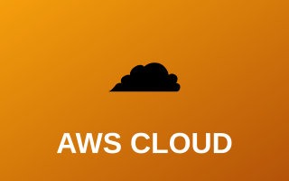

# ☁️ Cloud Projects

Cloud infrastructure projects demonstrating hands-on experience with AWS environments, secure architecture design, and cloud security best practices implementation.

---

## Projects

| Preview | Project |
|:---:|---|
|  | **[☁️ Secure AWS Environment](aws-environment.md)** Technical architecture and configuration of a secure AWS infrastructure.  `AWS` `IAM` `Architecture` `Hardening`  **[Open Report →](aws-environment.md)** |

---

## What You'll Learn

- **AWS Environment Setup & Configuration** — Secure infrastructure design, deployment, and architectural patterns
- **Cloud Security Architecture** — Security controls, compliance measures, and best practices
- **Infrastructure Hardening** — Security configuration and optimization of cloud resources

---

[← Back to Main Portfolio](../README.md)
