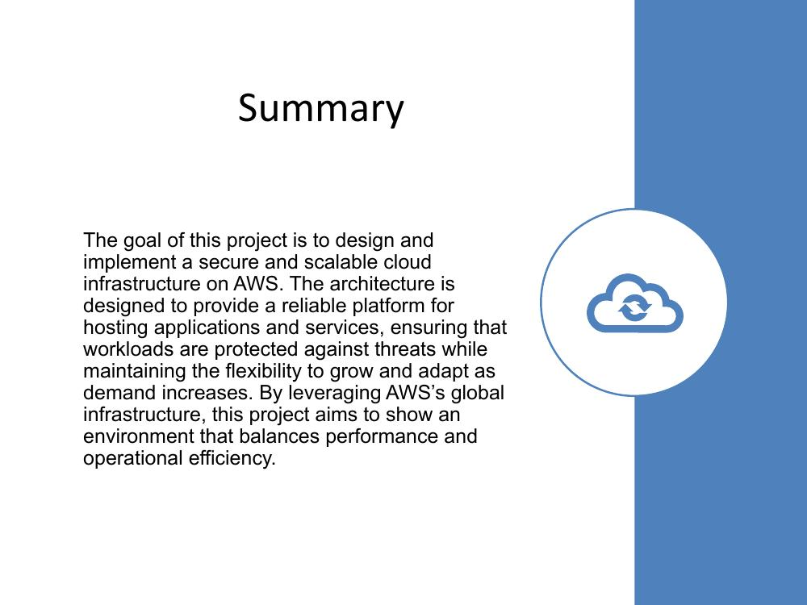
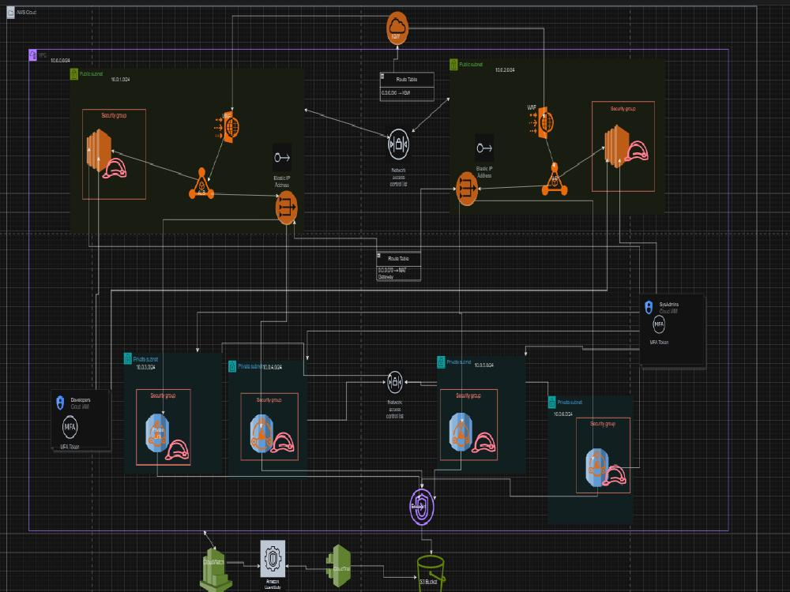
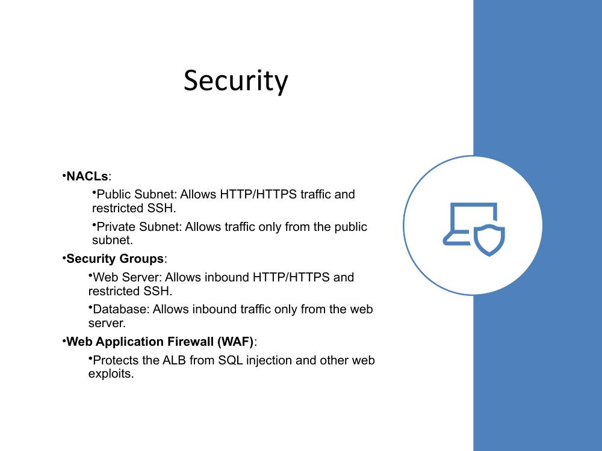
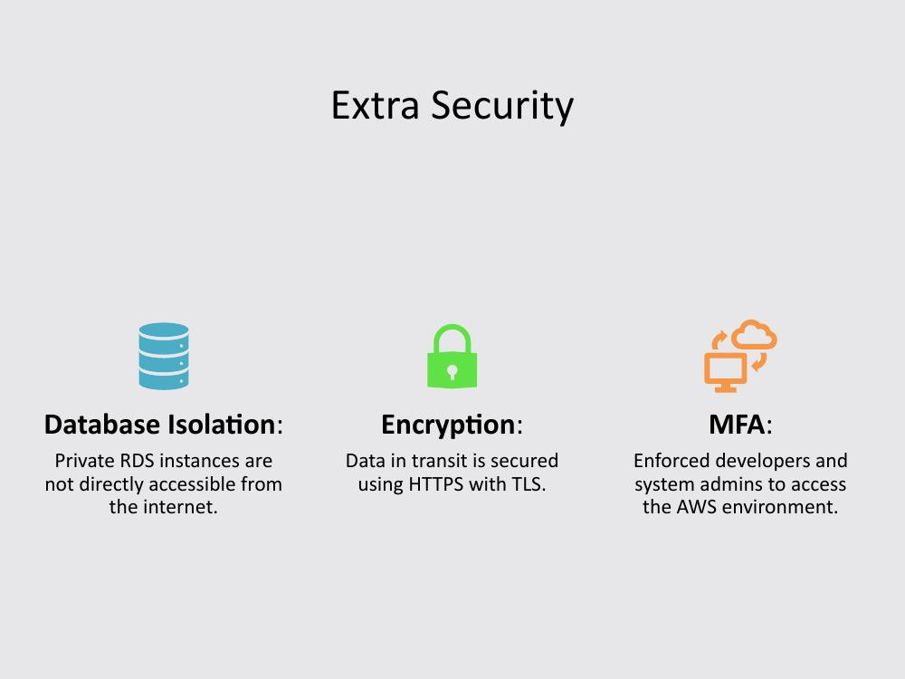
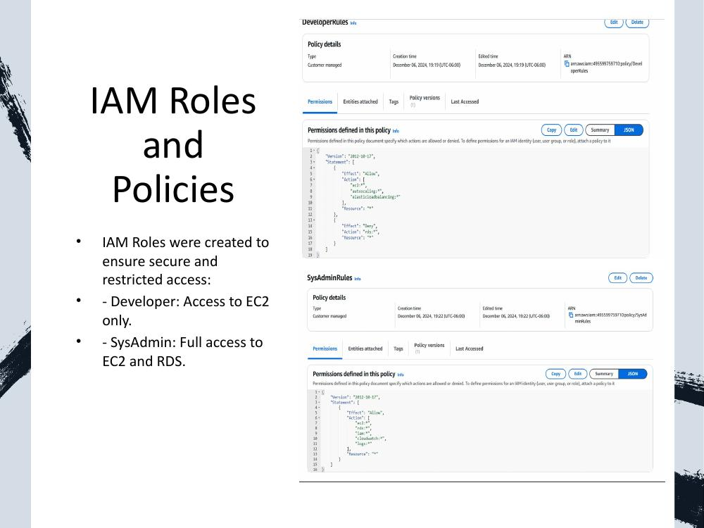
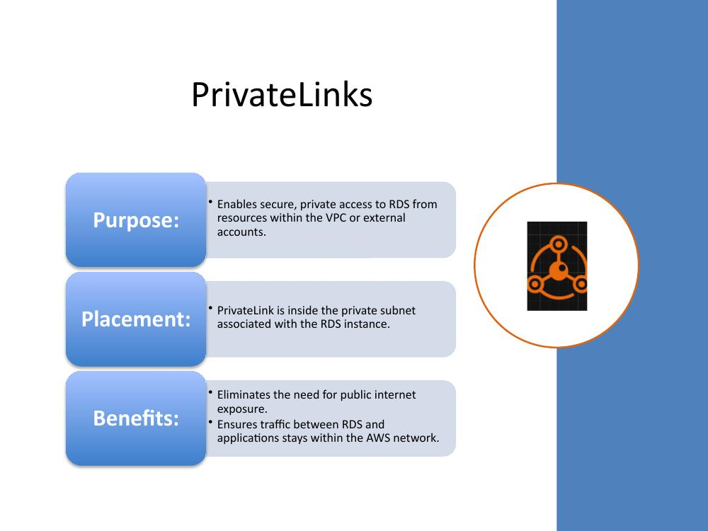
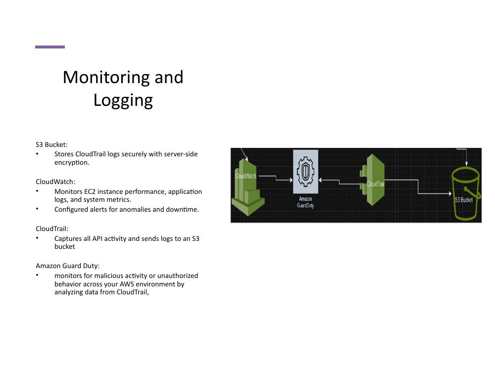
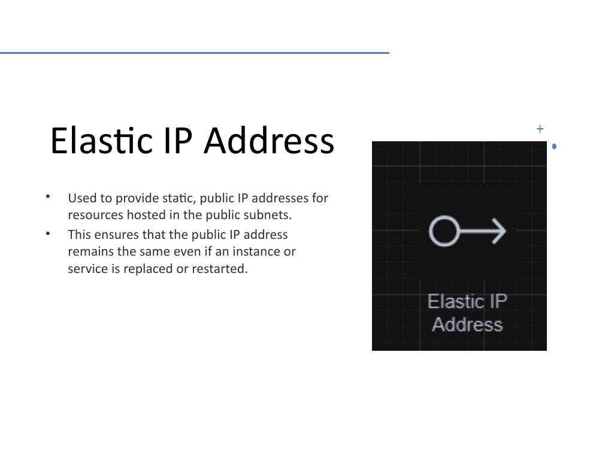
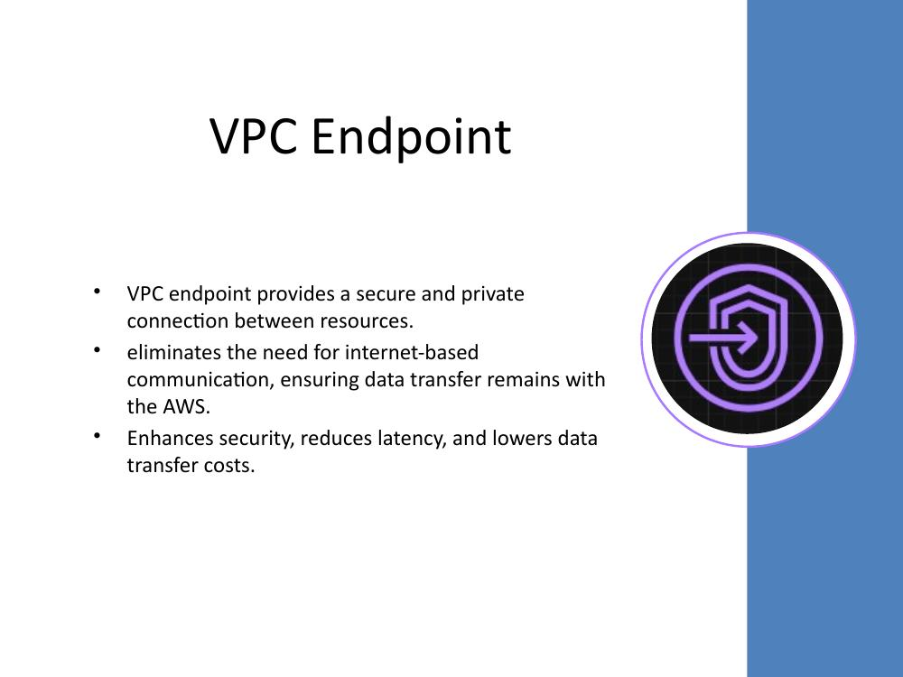

# Secure AWS Environment

**By: Chance Debbs**

## Summary

The goal of this project is to design and implement a secure and scalable cloud infrastructure on AWS. The architecture is designed to provide a reliable platform for hosting applications and services, ensuring that workloads are protected against threats while maintaining the flexibility to grow and adapt as demand increases. By leveraging AWS's global infrastructure, this project aims to demonstrate an environment that balances performance and operational efficiency.

## Network Security

- **NACLs:**
  - Public Subnet: Allows HTTP/HTTPS traffic and restricted SSH.
  - Private Subnet: Allows traffic only from the public subnet.
- **Security Groups:**
  - Web Server: Allows inbound HTTP/HTTPS and restricted SSH.
  - Database: Allows inbound traffic only from the web server.
- **Web Application Firewall (WAF):**
  - Protects the ALB from SQL injection and other web exploits.

## Extra Security Layers

| Control | Purpose |
|---|---|
| **Database Isolation** | Private RDS instances are not directly accessible from the internet. |
| **Encryption** | Data in transit is secured using HTTPS with TLS. |
| **MFA** | Enforced for developers and system admins accessing the AWS environment. |

## IAM Roles and Policies

IAM roles were created to ensure secure, least-privilege access:

- **Developer** — Access to EC2 only.
- **SysAdmin** — Full access to EC2 and RDS.

## PrivateLink

- **Purpose:** Enables secure, private access to RDS from resources within the VPC or external accounts.
- **Placement:** PrivateLink sits inside the private subnet associated with the RDS instance.
- **Benefits:**
  - Eliminates the need for public internet exposure.
  - Ensures traffic between RDS and applications stays within the AWS network.

## Monitoring and Logging

- **S3 Bucket** — Stores CloudTrail logs securely with server-side encryption.
- **CloudWatch** — Monitors EC2 instance performance, application logs, and system metrics; alerts configured for anomalies and downtime.
- **CloudTrail** — Captures all API activity and sends logs to an S3 bucket.
- **Amazon GuardDuty** — Monitors for malicious activity or unauthorized behavior across the AWS environment by analyzing data from CloudTrail.

## Elastic IP Address

Used to provide static, public IP addresses for resources hosted in the public subnets. This ensures the public IP address remains the same even if an instance or service is replaced or restarted.

## VPC Endpoint

- Provides a secure and private connection between resources.
- Eliminates the need for internet-based communication, ensuring data transfer stays within AWS.
- Enhances security, reduces latency, and lowers data transfer costs.

## NAT Gateway

The NAT Gateway allows private subnets to securely access the internet for updates without exposing them directly. Configured with an Elastic IP for public communication.

---

[← Back to Main Portfolio](../README.md)
