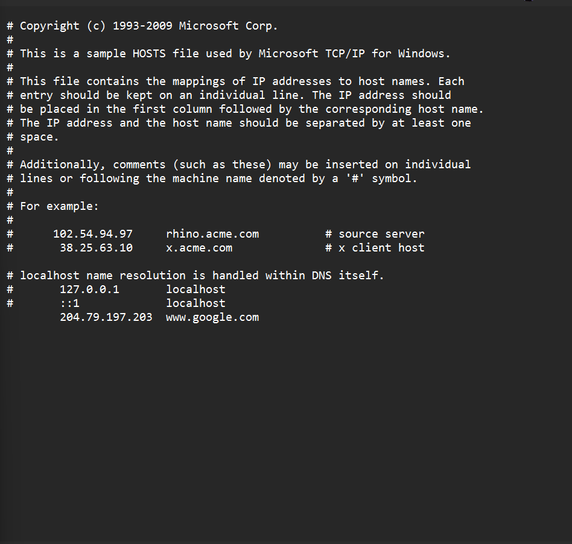
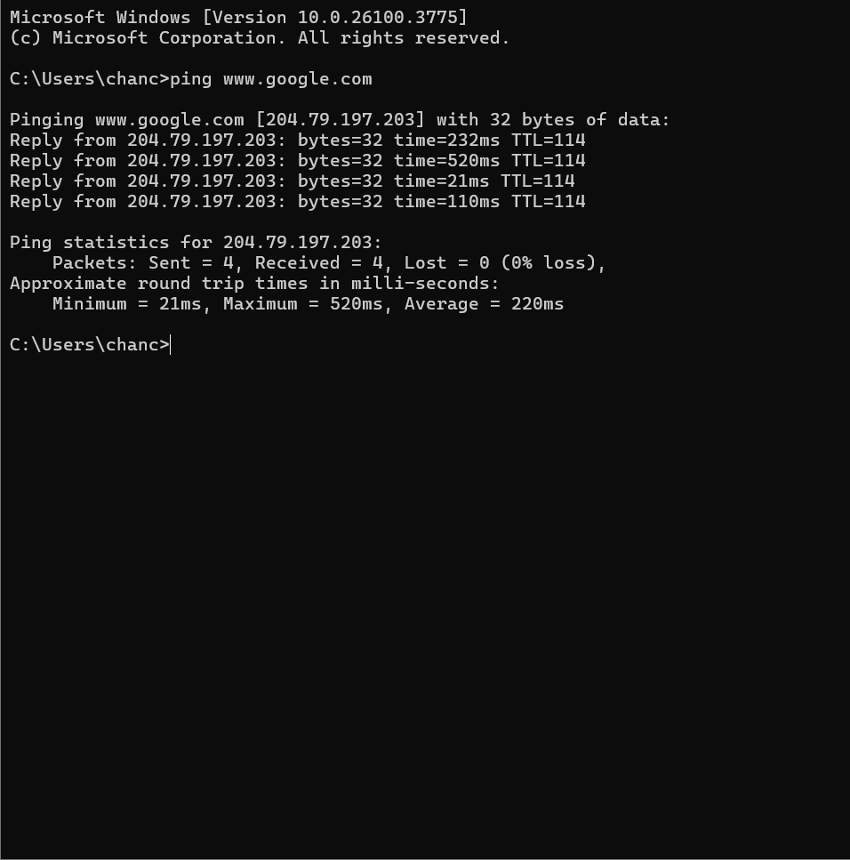

# Hosts File Manipulation Lab

Host File Attack Assignment

Added 204.79.197.203 to the host's file and linking it to www.google.com, which redirects requests for Google to MSN\'s IP address locally on your machine. After doing this, the computer will bypass DNS lookup and use the IP for Google, creating an override.

After changing the etc/hosts file, open the command prompt, ping ww.google.com and the specified IP that belongs to [www.msn.com](http://www.msn.com) will be redirected to www.google.com.
