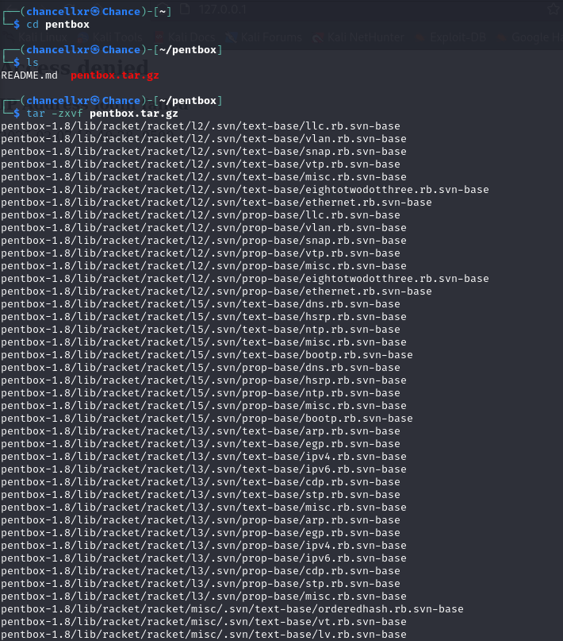
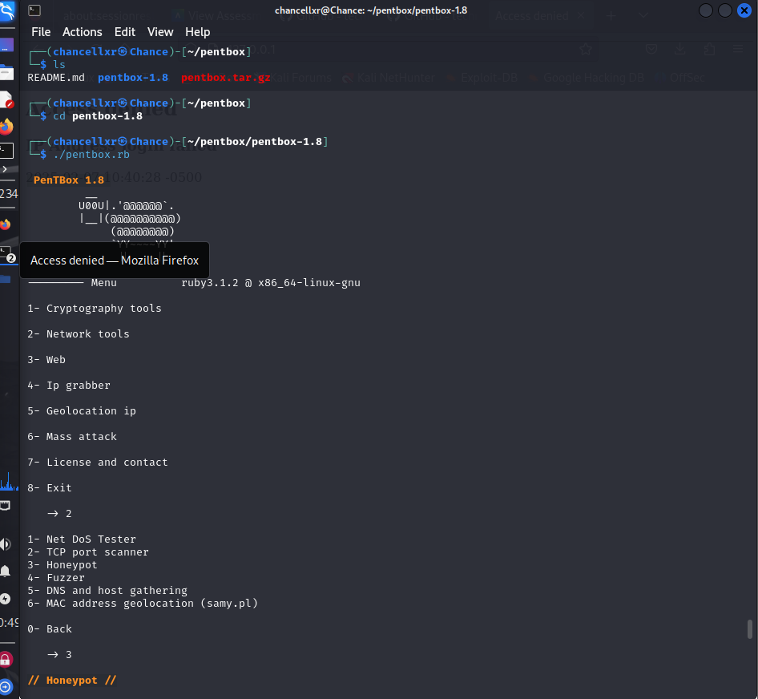
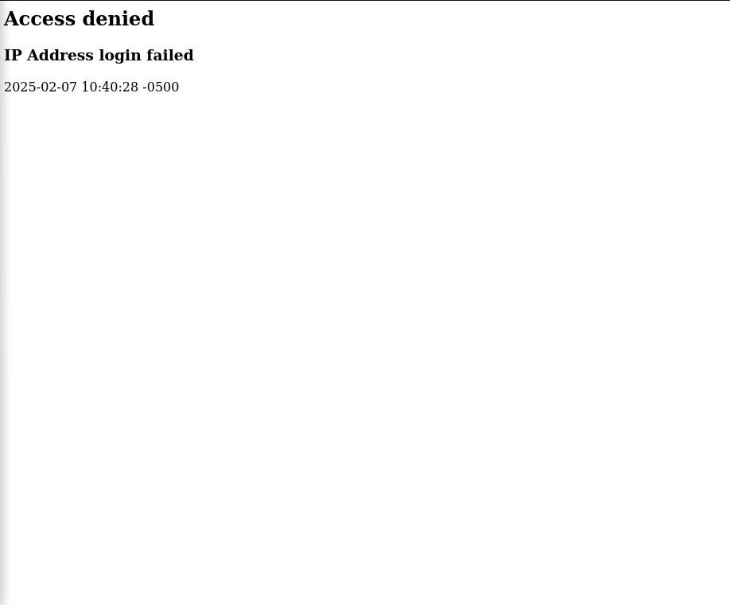
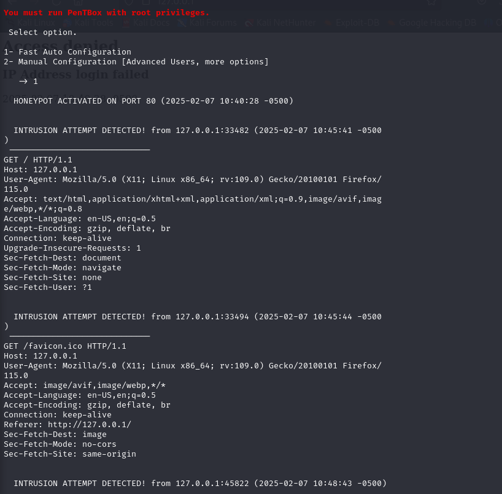
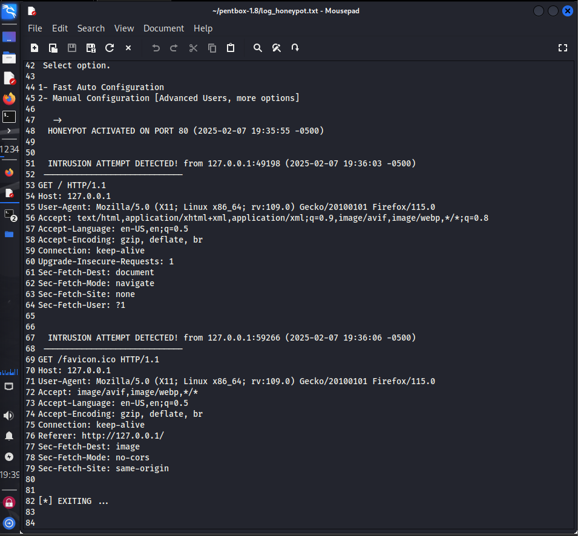

# Kali Linux Honeypot Configuration

A terminal session where the user navigates to the pentbox directory and extracts the pentbox tar file using the tar -zxvf command. The output lists extracted files for Pentbox to run in the terminal.

User navigates into the pentbox-1.8 directory and executes the pentbox.rb script, launching PenTBox 1.8. The user selects the \"Network tools\" option and then chooses the \"Honeypot\" feature to create a system to detect unauthorized access attempts.

An access denied message will appear showing a failed IP address login attempt on a web application. The timestamp will show that an unauthorized attempt was logged.

Running pentbox in the terminal to find any user trying to get in the honeypot. This scan runs in a terminal with a honeypot activated on port 80.

The screenshot displays the output of a honeypot running on port 80, which detects log intrusion attempts from the host. It captures HTTP requests, showing details such as the user agent and timestamps.
