# System Administration Lab Documentation

Sys Admin Lab Documentation

**Windows server**

-   Password: Sekur1ty!

-   IP: 192,168.1.50

**Windows 10 Hyper-V**

-   User: Administrator

-   Password: Sekur1ty!

-   IP: 192.168.1.2

-   Default Gateway: 192.168.1.0

-   Computer Name -WIN-VS

**Domain Expansion (Domain Controller)**

-   User: Administrator

-   Password: Sekur1ty!

-   DRSM: Passw0rd

-   Default Gateway IP: 192.168.1.1

**Mac Mini**

User: bing-mac

Password: Sekur1ty!

IP: 192.168.1.53

Gateway: 192.168.1.1

**Installing Windows OS for Hyper-V and DC**

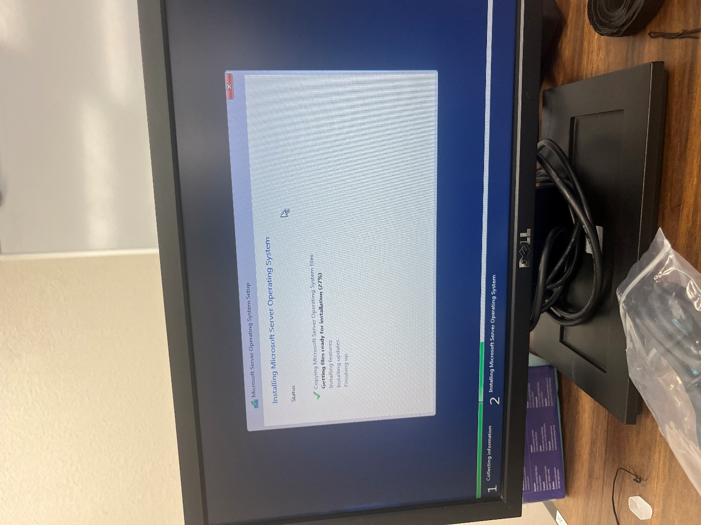

1.  Use Rufus or the Windows USB/DVD Download Tool to create a bootable USB with the downloaded ISO.

2.  Insert the USB, restart the server, and enter BIOS/UEFI settings to set USB as the primary boot device.

3.  Start Installation → Select language, time, and keyboard preferences, then click Install Now when prompted.

4.  Enter Product Key. Provide your Windows Server 2022 Datacenter product key or select I don't have a product key to proceed.

5.  Select Installation Type → Choose Windows Server 2022 Datacenter (Desktop Experience) for the full GUI version.

6.  Partition and Install → Select the target disk for installation, format, if necessary, then click Next to start the installation.

7.  Wait for Installation to Complete → The system will copy files and restart multiple times during installation.

8.  Initial Setup → Set an Administrator password and log into Windows Server 2022.

9.  Install Updates and Drivers → Connect to the internet and install Windows updates to ensure stability and security.

10. Install Server Roles → Open Server Manager and add required roles such as AD Domain Services, DNS, or DHCP.

**Installed Windows 10 for the client machine.**

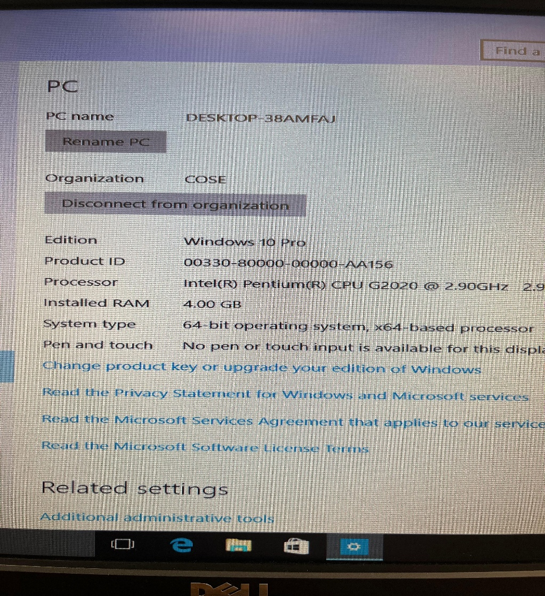

1.  Insert the Windows 10 installation USB and restart the server.

2.  Enter BIOS/UEFI settings → Set the USB as the primary boot device.

3.  Boot from the USB → Follow on-screen prompts for installation.

4.  Select Custom Installation → Choose the target drive for installation.

5.  Complete installation → Set up a user account and configure basic settings.

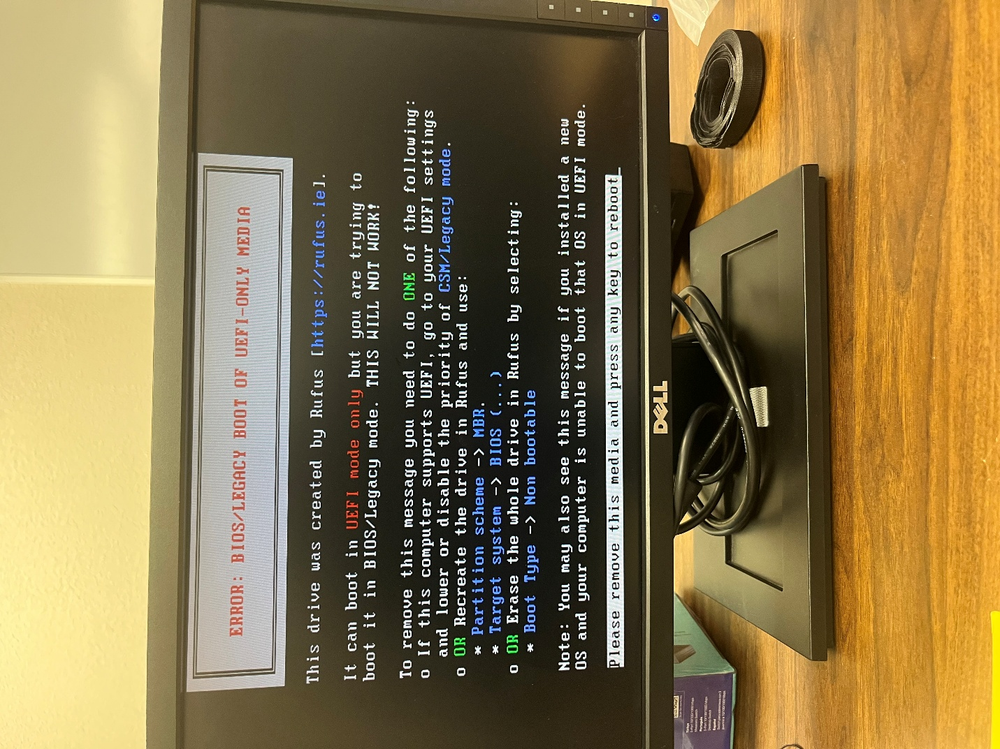

When using a usb to download the server, an error message related to booting from a UEFI-only in BIOS. The message explains that the drive was created with Rufus, but the computer is trying to boot it in BIOS mode, which won\'t work.

**Installing Active Directory**

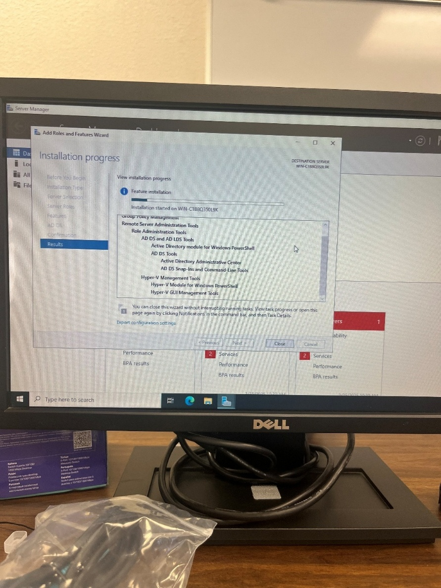

1.  Open Server Manager → Click Manage \> Add Roles and Features.

2.  Select Role-Based Installation → Choose the target server.

3.  Install Active Directory → Check AD Domain Services, AD Users and Computers, and other services that are required for the DC server.

4.  Click Install, wait for completion.

-   Only the Hyper-V server requires Hyper-V Manager; the DC server does not.

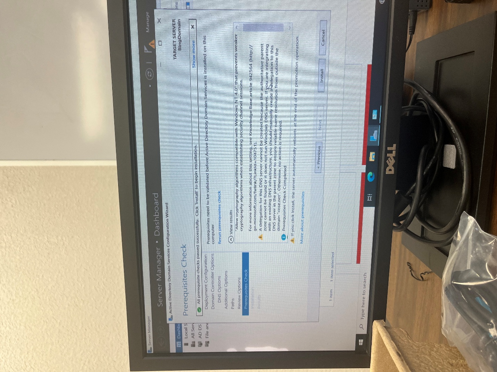

After going through the setup wizard for the domain server these options will show successfully promoting the domain controller. Make sure all prerequisites are met to install.

**Promoting the Windows Server to a DC**

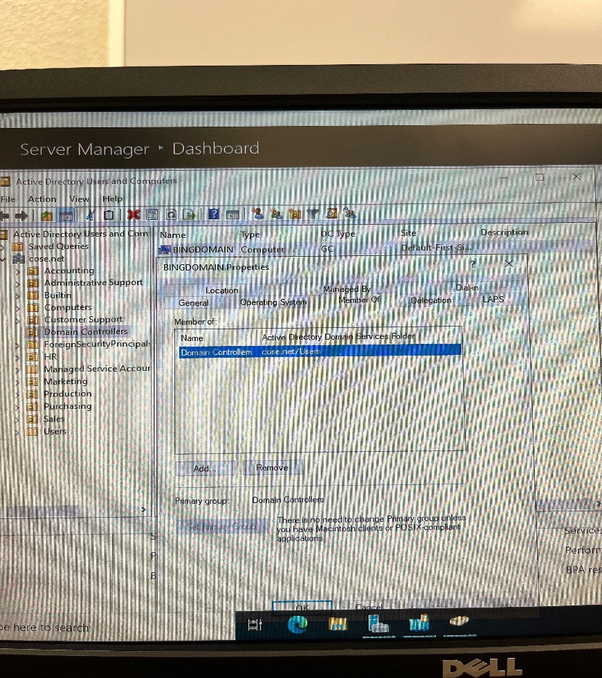

1.  Ensure the computer is properly configured, including assigning a static IP address and installing the required features.

2.  Use Server Manager to add the AD DS role.

3.  Launch the Active Directory Domain Services Configuration Wizard from Server Manager.

4.  Choose \"Add a new forest\" or \"Add a domain to an existing forest,\" depending on what is needed.

5.  Specify the domain name, e.g., \"BINGODOMAIN.\"

6.  Select forest and domain functional levels, set DNS options, and configure the Directory Services Restore Mode password.

7.  Validate and Install: Review configurations, ensure prerequisites are met, and begin installation.

8.  After the setup, the computer will reboot, becoming a functional Domain Controller.

**Adding the Hyper-V server to RODC**

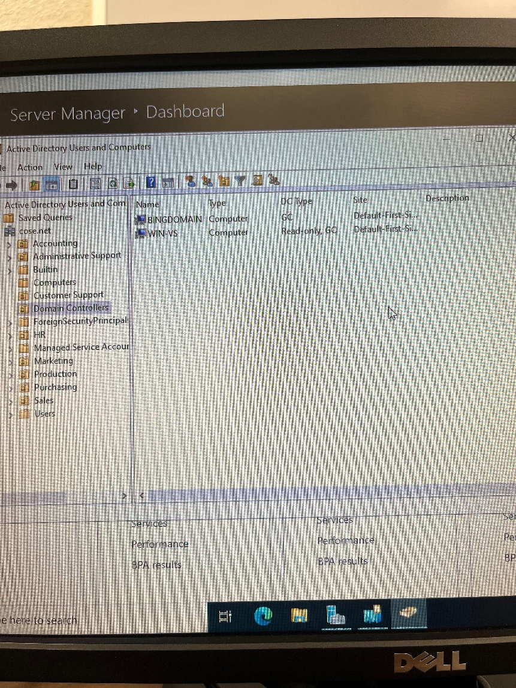

1.  In Active Directory Users and Computers, navigate to the \"Domain Controllers\" container, right-click, and select \"Pre-create a Read-only Domain Controller account.\"

2.  Use the wizard to assign WIN-VS as the RODC, specify its site placement, and delegate administrative permissions to specific users or groups.

3.  After installing the AD DS role, click the notification flag in Server Manager, select \"Promote this server to a domain controller,\" and choose the RODC option in the wizard.

4.  Set DNS options, enable Global Catalog, configure Restore Mode password, validate prerequisites, and finalize the promotion.

5.  WIN-VS will restart, completing the transition to an RODC.

**Adding Client machine to the domain**

1.  Open the Start menu, search for \"Settings,\" and navigate to **System** \> **About**.

2.  Scroll down to \"Join a domain\" and click on \"Change settings\" under **Device** specifications.

3.  In the dialog box, click \"Change,\" select \"Domain,\" and input \"cose.net\" as the domain name.

4.  Provide the username and password of an authorized domain account when prompted.

5.  Complete the process and restart the machine to apply domain settings.

6.  Log in with domain credentials and check \"System Settings\" again to ensure the machine is listed under the domain \"cose.net.\"

**Configuring DHCP on a DC Server**

-   The scope's name is Hacktua.

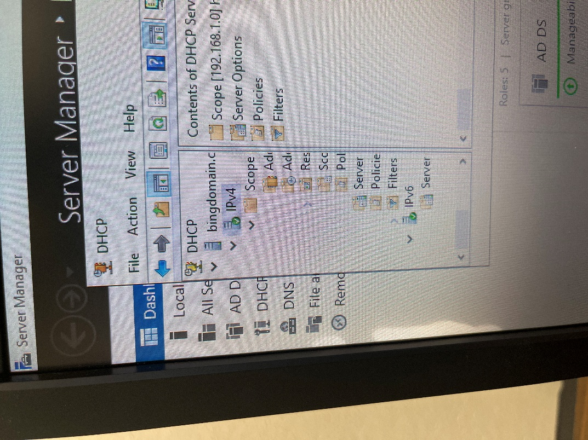

1.  Install the DHCP role via Server Manager using the \"Add roles and features\" wizard.

2.  Authorize the server in the DHCP Management Console to enable it within the domain.

3.  Create a new scope by specifying the IP address range, subnet mask, and exclusions.

4.  Configure scope options such as the default gateway, DNS server, and other settings.

5.  Activate the scope to allow DHCP to start leasing IP addresses to clients.

6.  Test the configuration by connecting a client machine to ensure it receives an IP address.

**Assigning IP information to all computers for basic communication**

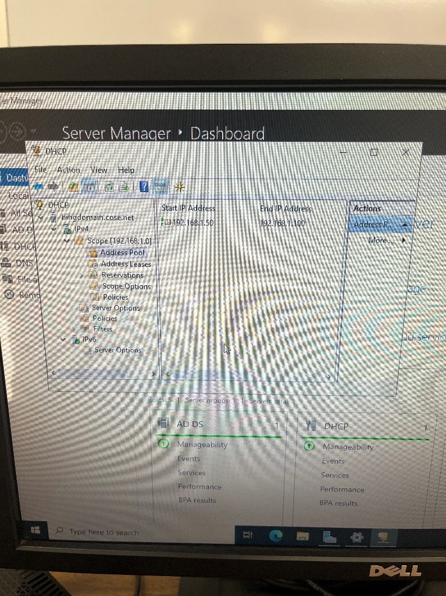

1.  Open the DHCP Management Console from Server Manager to access IP configuration tools.

2.  Create a new IP Scope by specifying the range of IP addresses to be assigned (192.168.1.50- 192.168.1.100)

3.  Define Exclusions and Reservations to ensure critical devices keep static IP addresses.

4.  Set up Scope Options, including the default gateway, DNS servers, and WINS servers.

5.  Activate the IP Scope to start assigning IP addresses dynamically to client computers.

6.  Verify the setup by checking the Address Leases to confirm successful communication.

**Adding Users to Active Directory**

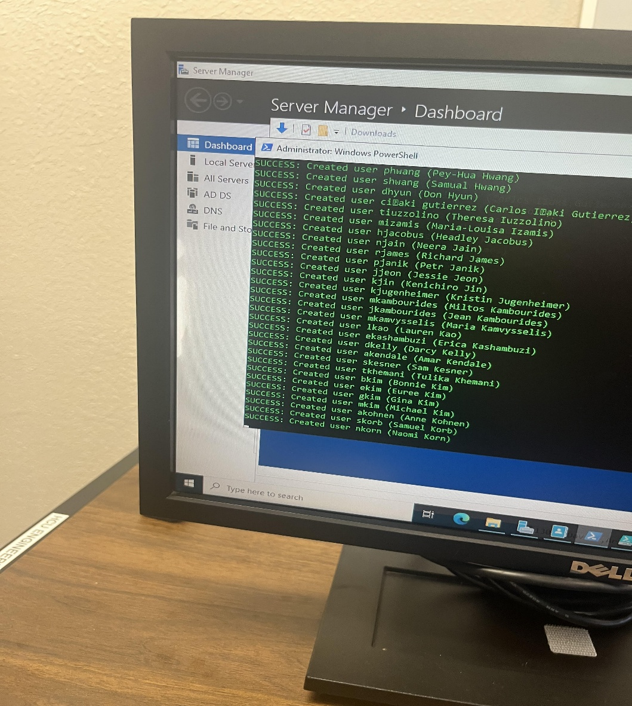

Using the PowerShell script to add 400 users. After adding all the users, there will be names that need to be rewritten. For the users with the wrong wording, there will be a property setting to change the names, so each user works properly.

-   The PowerShell script we used to import 400 users. Instead of manually putting in every user which would've taken weeks, the following script is used.

Import-Module ActiveDirectory\
\
\$Domain = \"@cose.net\"\
\$NewUsersList = Import-CSV \"C:\\User_List.csv\"\
\
foreach (\$User in \$NewUsersList) {\
   try {\
       \$firstName = \$User.firstName.Trim()\
       \$lastName = \$User.lastName.Trim()\
       \$userPassword = \$User.Password\
       \$employeeID = \$User.EmployeeID\
       \$department = \$User.Department\
       \$fullName = \"\$firstName \$lastName\"\
\
       # Initial sAMAccountName (first initial + last name, lowercase)\
       \$baseSam = (\$firstName.Substring(0,1) + \$lastName).ToLower()\
       \$sAMAccountName = \$baseSam\
       \$userPrincipalName = \"\${sAMAccountName}\${Domain}\"\
\
       # Check for existing users with same base name and adjust if needed (LIMIT loop)\
       \$counter = 1\
       while (Get-ADUser -Filter \"SamAccountName -eq \'\$sAMAccountName\'\" -ErrorAction SilentlyContinue) {\
           if (\$counter -gt 10) {\
               throw \"Too many duplicate accounts for base \'\$baseSam\'. Check the CSV or AD.\"\
           }\
           \$sAMAccountName = (\$baseSam + \$counter).ToLower()\
           \$userPrincipalName = \"\${sAMAccountName}\${Domain}\"\
           \$counter++\
       }\
\
       # If user with EXACT same sAMAccountName still exists, delete them\
       \$existingUser = Get-ADUser -Filter \"SamAccountName -eq \'\$sAMAccountName\'\" -ErrorAction SilentlyContinue\
       if (\$existingUser) {\
           Write-Host \"User \$sAMAccountName already exists. Deleting\...\" -ForegroundColor Yellow\
           Remove-ADUser -Identity \$existingUser -Confirm:\$false -ErrorAction Stop\
       }\
\
       # Create the new AD User\
       New-ADUser \`\
           -Name \$fullName \`\
           -GivenName \$firstName \`\
           -Surname \$lastName \`\
           -SamAccountName \$sAMAccountName \`\
           -UserPrincipalName \$userPrincipalName \`\
           -AccountPassword (ConvertTo-SecureString \$userPassword -AsPlainText -Force) \`\
           -Enabled \$true \`\
           -Path \"CN=Users,DC=cose,DC=net\" \`\
           -Department \$department \`\
           -EmployeeID \$employeeID \`\
           -ChangePasswordAtLogon \$true -ErrorAction Stop\
\
       Write-Host \"SUCCESS: Created user \$sAMAccountName (\$fullName)\" -ForegroundColor Green\
   }\
   catch {\
       Write-Host \"ERROR processing \$(\$User.firstName) \$(\$User.lastName): \$\_\" -ForegroundColor Red\
   }\
}

**MAJOR ISSUE!**

Ran into an error that the domain did not have network access. Tried to reset the password through the command prompt, but more issues came up. Ended up reinstalling the Hyper-V from scratch. The Issue was that the virtual switch was picked during configuration. Make sure the box for the virtual switch is unchecked!

**Setting IP Info to Client Machine**

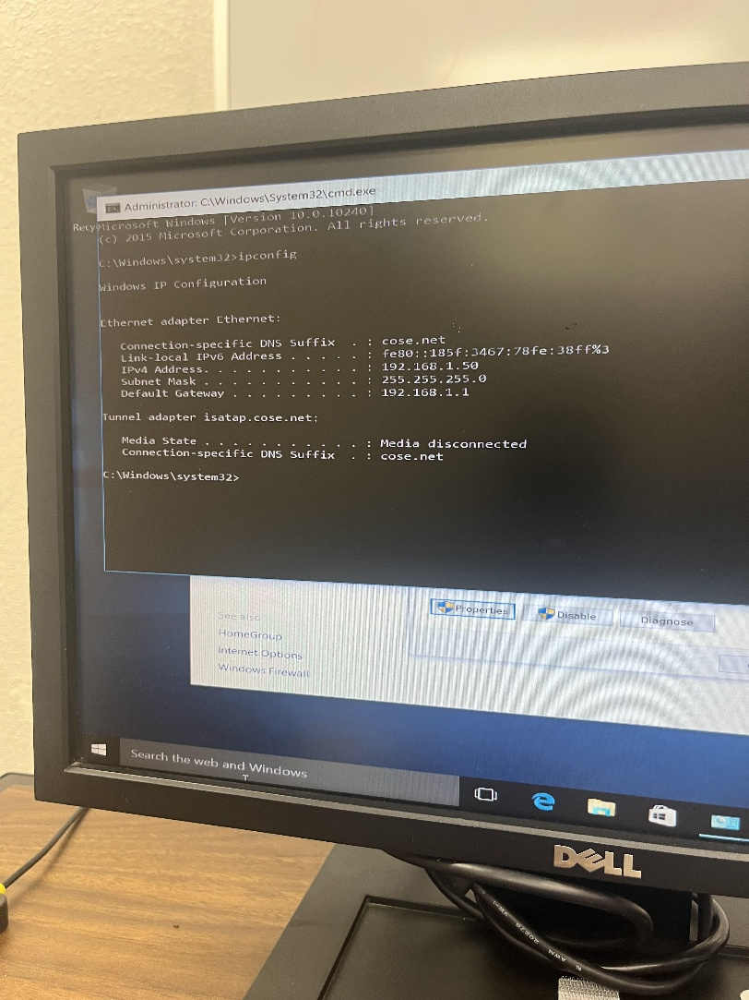

Assigned a static IP throughout each network in the DC server. (The example is a static IP being assigned to the Windows server being 192.168.1.50.) To do this, go into the network settings, click on the IPv4 option, and change the IP from automatic to "Use the following address:" option to set that static IP.

**Adding VMs in Hyper-V Server**

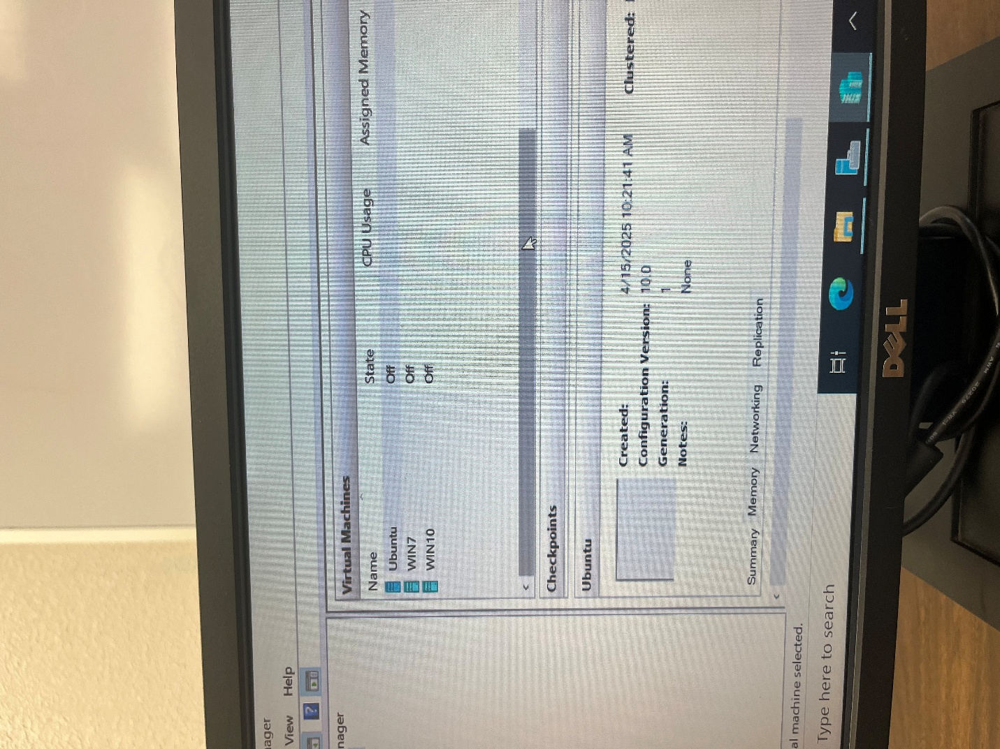

Go into the Hyper-V server and open the server manager. After doing so, proceed with the Hyper-V manager, and import needed virtual servers using a USB (Windows 7, Windows 10, Ubuntu.)

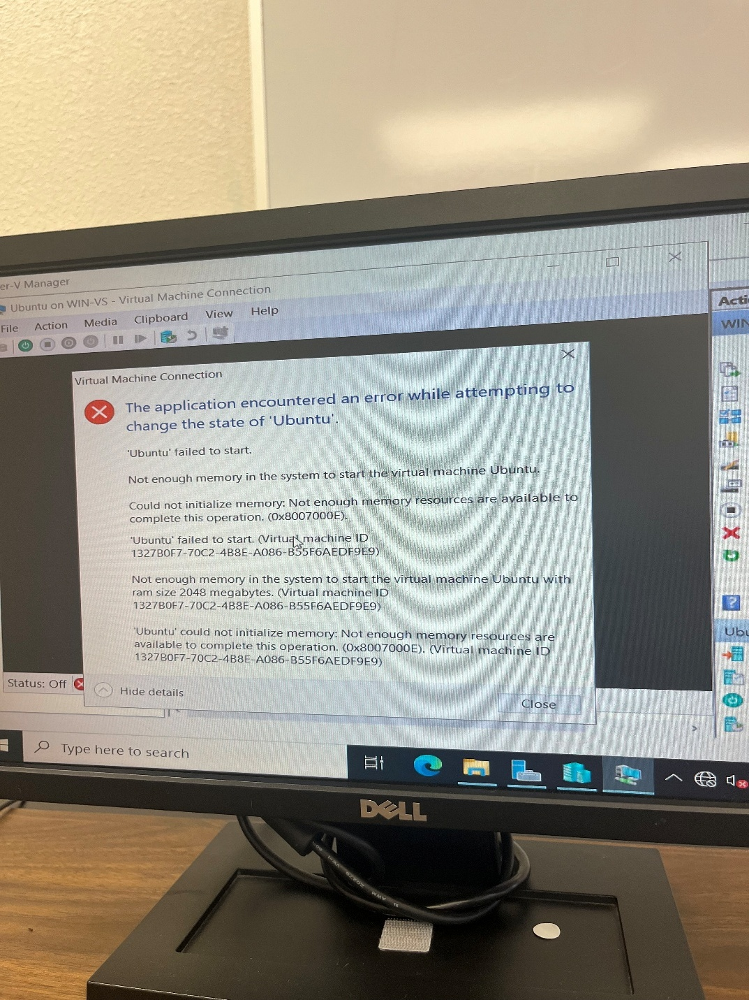

After downloading the VM's if not enough RAM is implemented in the PC there will be an error stopping the process of connecting to the VM. Need at least 4 GB RAM.

**Setting up VM (WIN 10) On Hyper-V Manager**

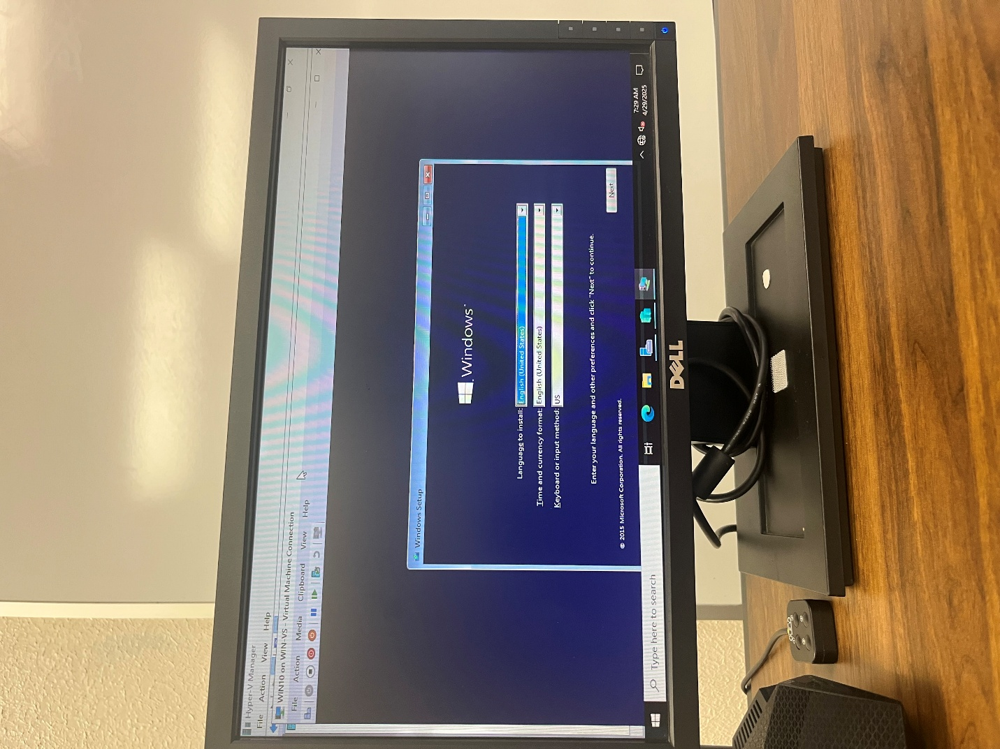

After adding more RAM to the server, the Hyper-V Manager is configured to use more memory. The increased memory allows the VM to handle intense tasks more efficiently, enhancing overall functionality. This upgrade optimizes system resources, ensuring smooth navigation within the virtualized environment.

**Adding Users to their designated OU**

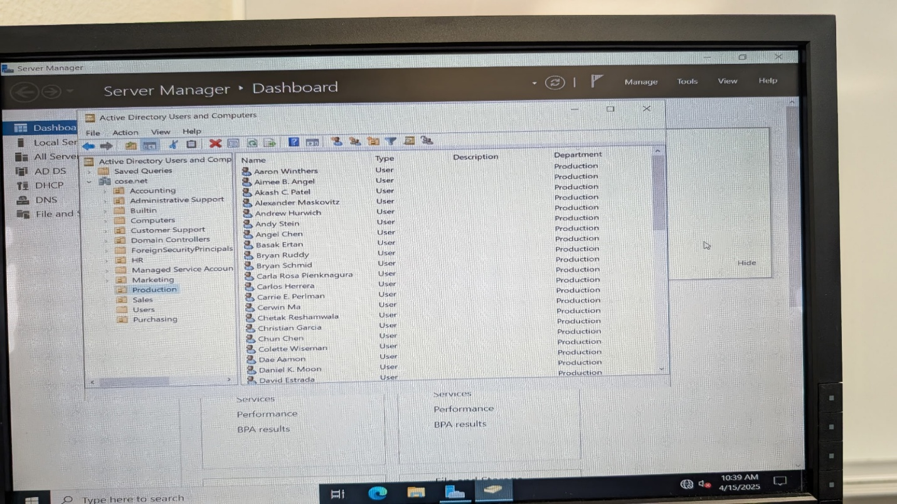

Added all users into the specific OU to match the department. It shows the structure of organizational units and their associated users within a domain. Each OU represents a department or category, which helps in organizing and managing resources within the Windows Server.

-   ex: Aaron Winthers belongs in the production department.

1.  Open Active Directory Users and Computers

    -   Search for it in the Start menu and open.

2.  Find the OU

    -   Locate the department's OU (e.g., \"Production\").

3.  Move the User

    -   Right-click the user → Select Move → Choose the OU.

4.  Add a New User (Optional)

    -   Right-click the OU → Select New → User → Fill in the details.

**Enforcing the Password Policy**

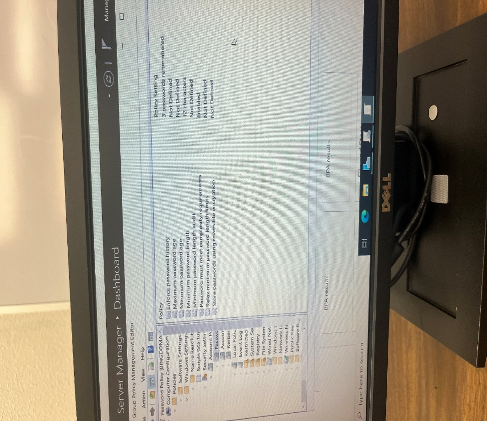

1.  Open Group Policy Management from the Server Manager

2.  Navigate to Default Domain Policy under \"Group Policy Objects\" for the domain.

3.  Edit the policy by right-clicking and selecting **Edit**.

4.  Expand Computer Configuration \> Policies \> Windows Settings \> Security Settings \> Account Policies \> Password Policy.

5.  Configure settings such as password complexity, password length, and maximum/minimum password age to meet security requirements.

**Folder Redirection**

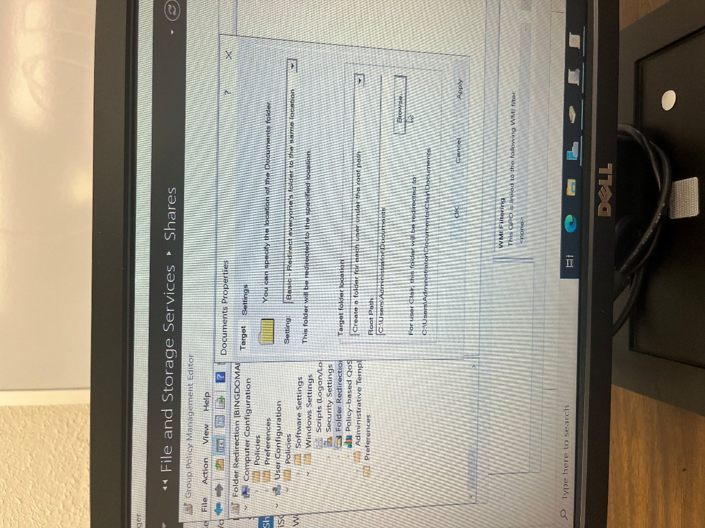

1.  Open Group Policy Management and edit an existing or new GPO.

2.  Go to User Configuration \> Policies \> Windows Settings \> Folder Redirection.

3.  Select the folder to redirect (e.g., Documents), configure its properties, and specify a shared path.

**Backup for All Servers**

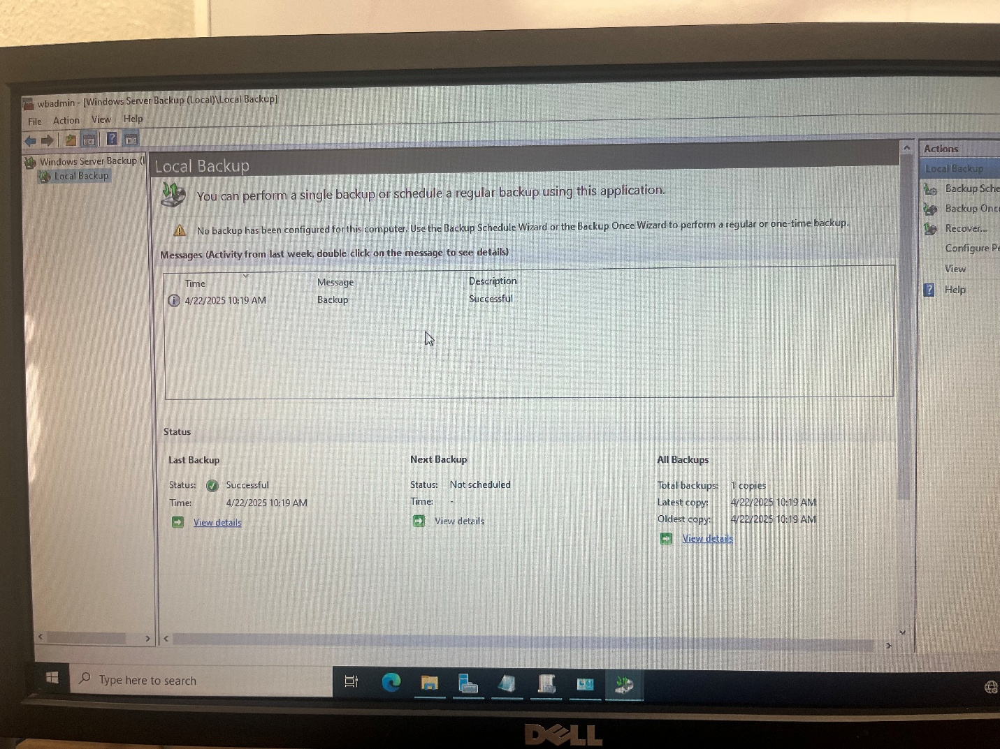

This image shows the Windows Server Backup interface with information about the last backup, next scheduled backup, and all backups.

1.  Open Windows Server Backup.

2.  Click Backup Schedule to set up regular backups.

3.  Use Backup Once for a one-time backup.

4.  Check the Last Backup details.

5.  View the Next Backup status.

6.  Review All Backups for previous copies.

**Remoting in DC From Another Device**

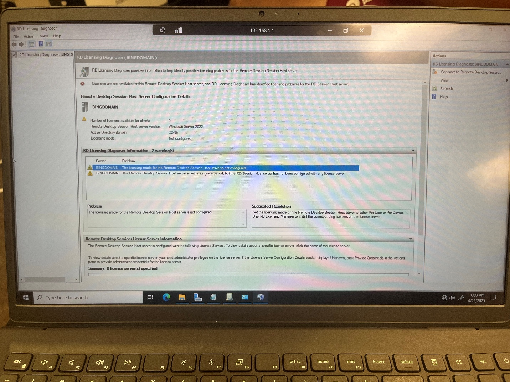\
Remoting into a Domain Controller allows you to manage its settings and resources securely from another computer.

1.  Open a Remote Desktop Connection on your computer.

2.  Enter the Domain Controller's IP address or hostname.

3.  Click Connect.

4.  Provide your admin username and password to finally remote in the DC server.

**replication of DC data**

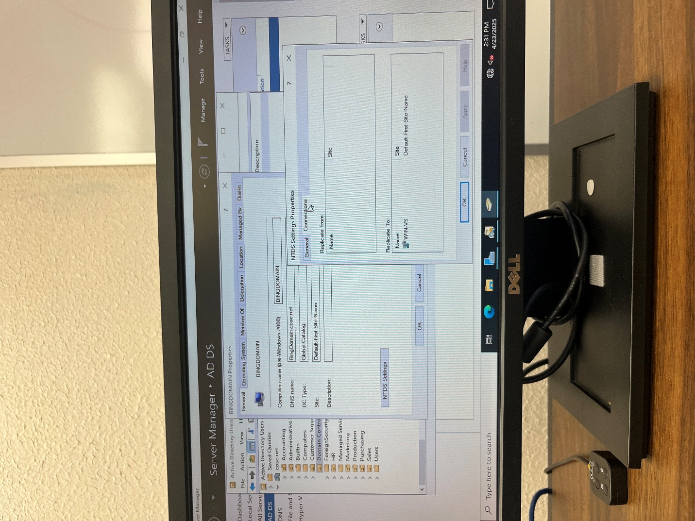\
Replicating the Domain Controller (DC) data to the Hyper-V server ensures Active Directory information is synchronized and available in the virtualized environment.

1.  Open Server Manager on your Windows Server.

2.  Navigate to Active Directory Users and Computers.

3.  Expand the Domain Controller on the left-hand panel.

4.  Go to NTDS Settings in the properties of BINGDOMAIN.

5.  Configure replication settings as needed.

6.  After replicating this message will appear:\
    **Active Directory Domain Services has replicated the connection.**

**Extra Credit (Mac Mini)**

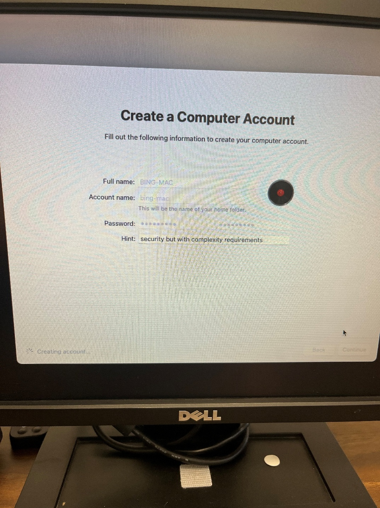

**Creating Mac mini credentials:**

Full name: BING-MAC

Account name: bing-mac.

Password: Sekur1ty!

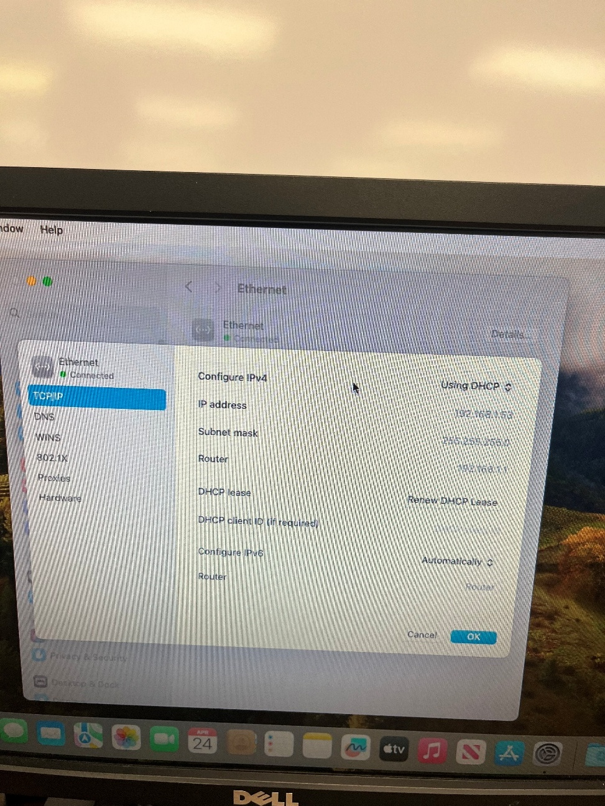

TCP/IP settings of the Mac Mini machine, where the DHCP protocol is configured to automatically retrieve IP information from the DC server.

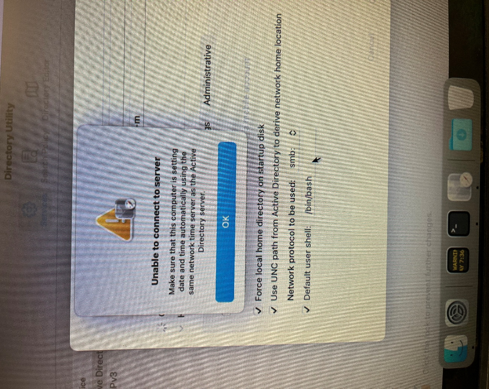

**Follow these directions if this error occurs:**

1.  Open System Preferences and go to Date & Time.

2.  Check the Set date and time automatically and ensure it\'s using the same network time server as the DC server.

3.  Confirm the time zone matches the DC server time zone.

4.  If needed, manually adjust the date and time to match the DC server.

5.  Restart the Mac Mini and test the connection again.

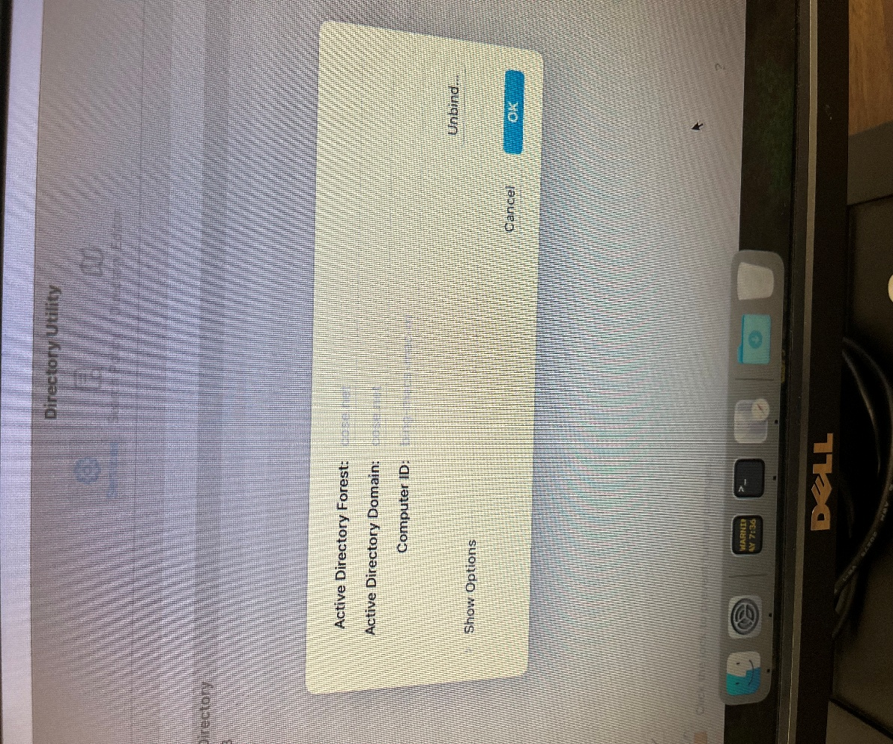

After matching the time zone and clock on the Mac Mini with the domain controller, the connection issues were resolved, and the configuration process was completed. This allowed the Mac Mini to connect to the Active Directory domain.

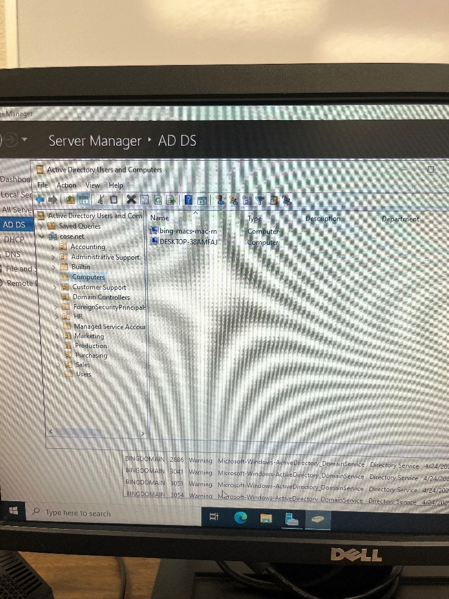

To verify the Mac Mini is a part of the DC server, open Active Directory Users and Computers, go to the computers section on the left-hand panel, and search for the Mac Mini\'s Computer Name to confirm it's in the domain.
