# Wireshark Network Analysis Lab

**Wireshark Lab Documentation**

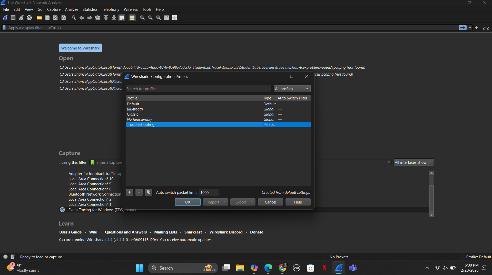

Go into Wireshark, right-click on the profile in the bottom right corner and name the new profile "Troubleshooting." Click the "OK" button after typing the name.

**Lab 2: Identify High Latency**

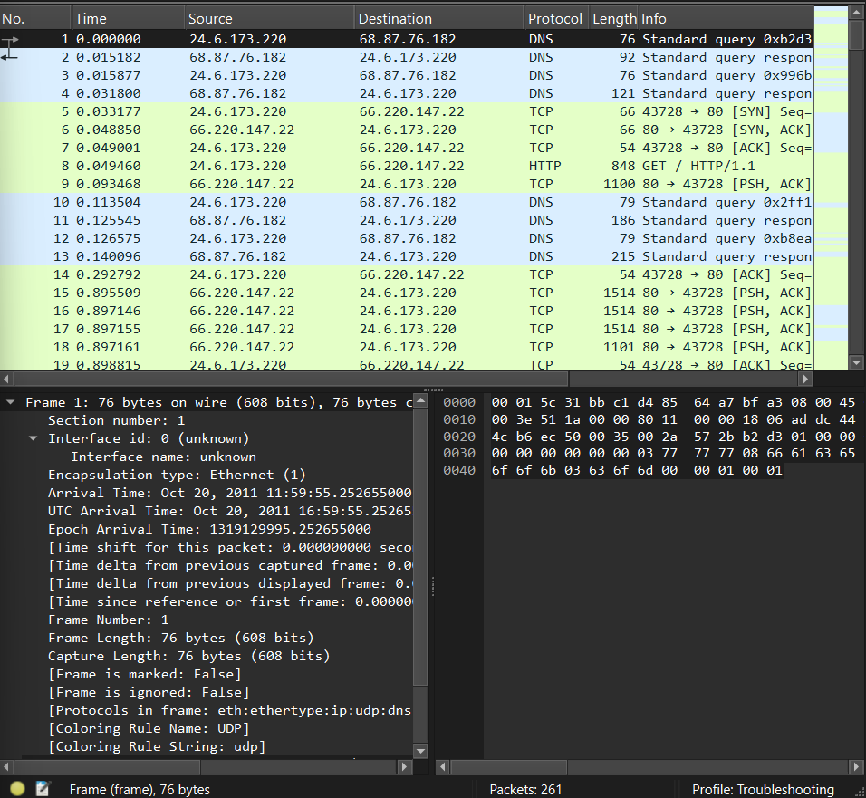

Open the lab-timeanalysis.pcapng file.

Click on the first packet and after, right click on the frame 1 section to expand the subtree.

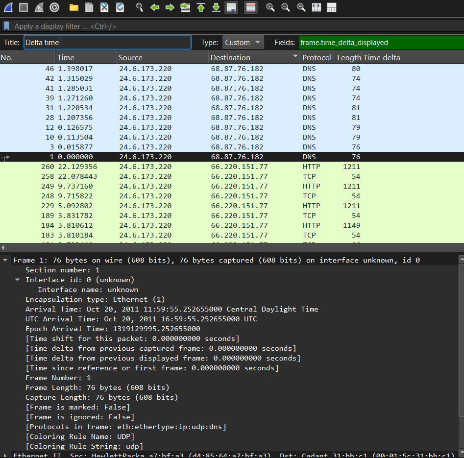

When the frame 1 section is expanded go down to "Time delta from previous displayed frame and right click to add as column.

Right click on the new column and click edit column. There, you will change the original title to "Delta Time."

Time delta from previous displayed frame

-   Packet 2: 0.015182000 ms

-   Packet 4: 0.015923000 ms

-   Packet 11: 0.012041000 ms

-   Packet 13: 0.013521000 ms

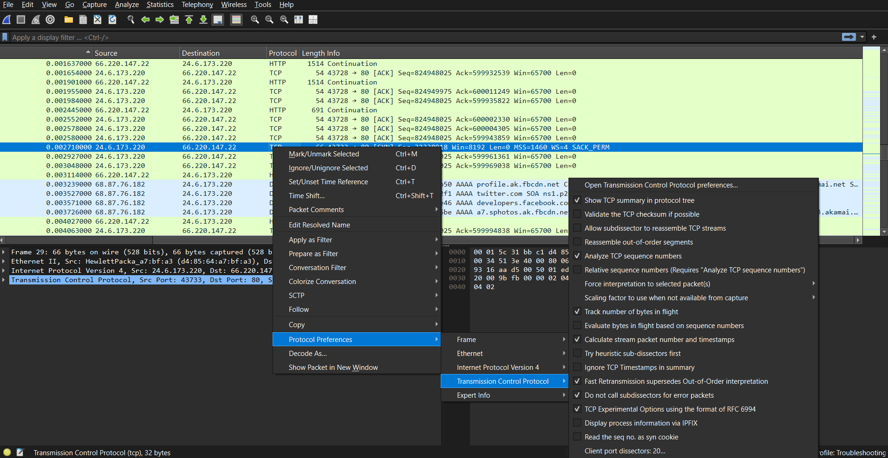

In the Packet Details pane of packet 29, right-click on the TCP header and view Protocol Preferences. Ensure Calculate conversation timestamps is enabled and Allow subdissector to reassemble TCP streams is disabled.

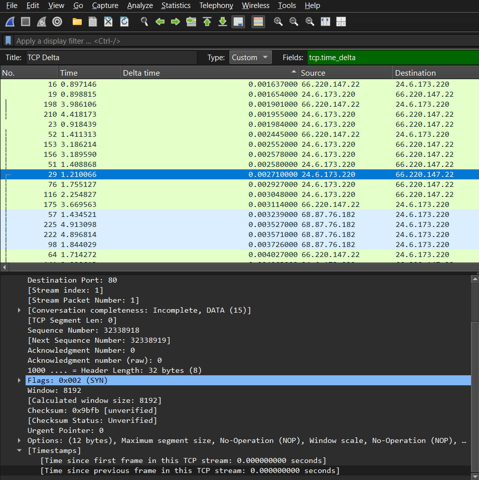

Go over to packet 29 and expand the Time Control Protocol section to find the "Timestamp" subsection. There, right click the "Time since previous frame in this TCP stream" option and add as column. Lastly. Right click on the column and rename the original title to TCP Delta.

What is the round trip path latency seen during this TCP connection between 24.6.173.220 and 66.220.147.22? 0.019210000 ms.

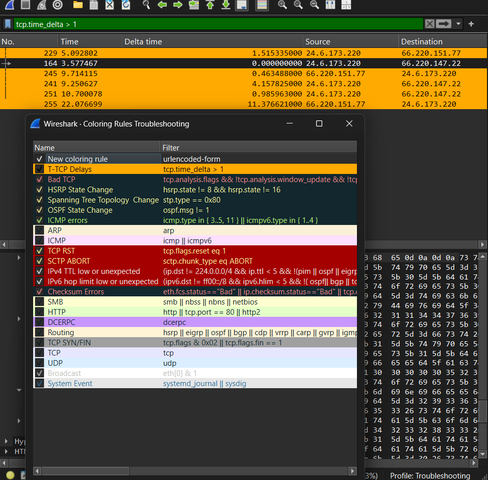

Now you will make a coloring rule to help locate large delays in a TCP stream. Right-click on the Time since previous frame in this TCP stream line in Packet 32 (at the end of the TCP header) and select Colorize with Filter \| New Coloring Rule. You will need to name your new coloring rule and alter the filter and coloring as follows:

Name: T-TCP Delays

Filter: tcp.time_delta \> 1

Foreground Color: Black

Background Color: Orange

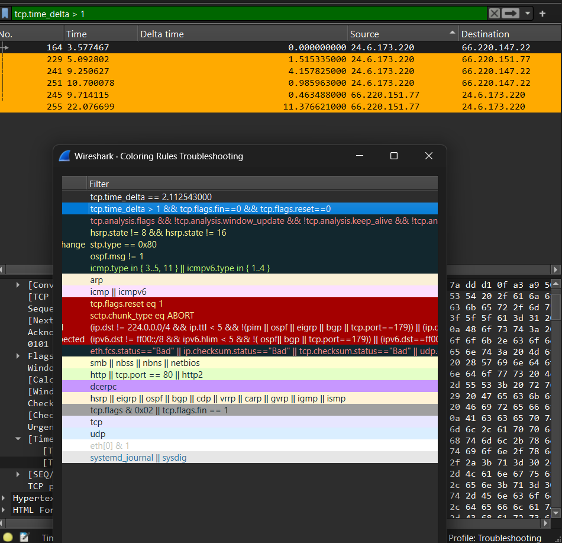

Edit your T-TCP Delays coloring rule filter as follows:

**tcp.time_delta \> 1 && tcp.flags.fin==0 && tcp.flags.reset==0**

Filtered TCP Delta Data

-   Packet 255:12.323981000

-   Packet 251: 6.174815000

-   Packet 241: 4.832454000

-   Packet 245: 4.562358000

-   Packet 164: 2.112543000

-   Packet 229: 1.261020000

The varying TCP delta times in your chart can be due to factors such as network congestion, processing delays, and application delays. Analyzing these factors using tools like Wireshark can help pinpoint the cause of the delays.

**Lab 3: Find the Top Talkers and Protocols/Applications on a Network**

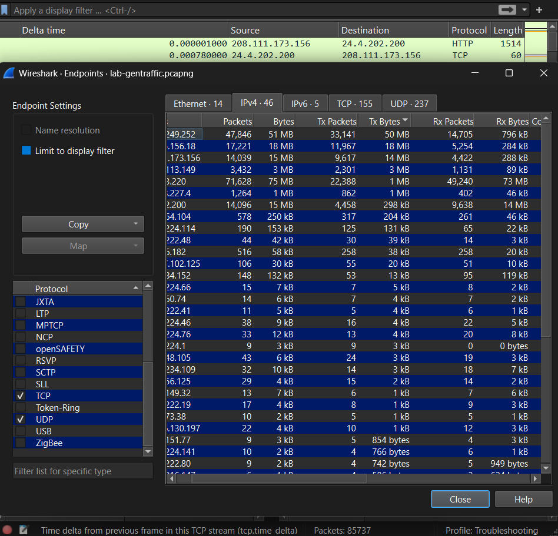

Open the lab-gentraffic.pcapng file.

select Statistics Endpoints and click on the IPv4 tab. Click on the Tx Bytes and click on the column twice to find the host with the most bytes.

Most active TCP conversion (bytes):

-   Address & Port A: 107.22.234.109 , 443

-   Address & Port B: 24.4.202.200 , 4714

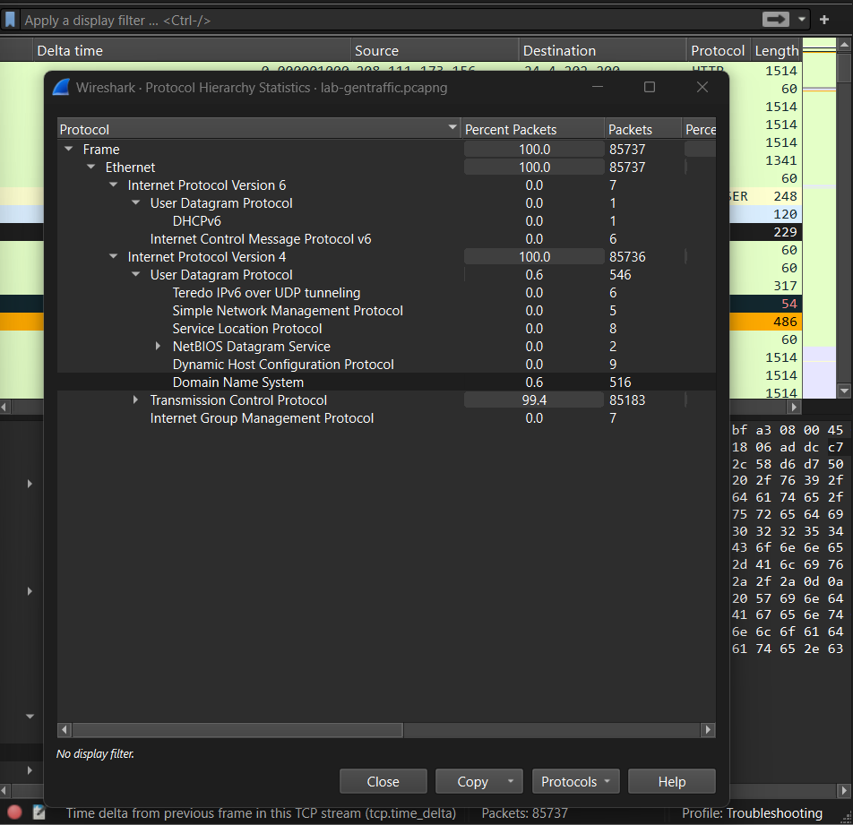

Access Statistics Protocol Hierarchy to analyze the different protocols present in a captured network traffic file.

Most Active UDP-Based Application

-   Application: Domain Name System

-   \# of packets: 516

Most Active TCP-Based Application

-   Application: Hypertext Transfer Protocol Data

-   \# of packets: 58302

**Lab 4: Create and Use an I/O Graph to Spot Performance Issues**

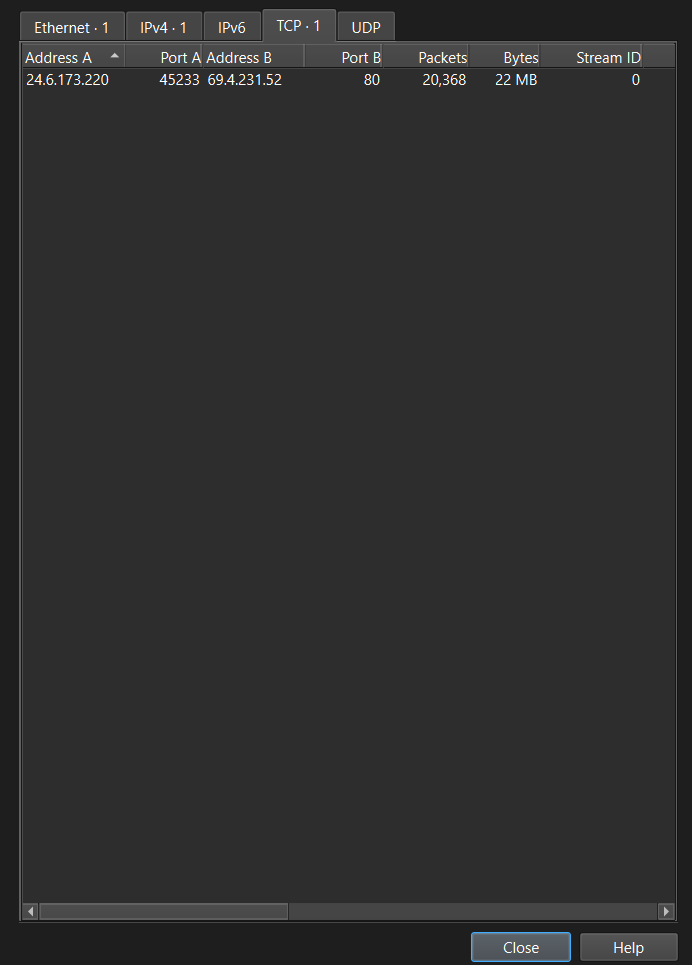

Open the lab-iograph.pcapng file.

To make sure a conversation was had, go to Statistics Conversations to validate the conversation between the two users.

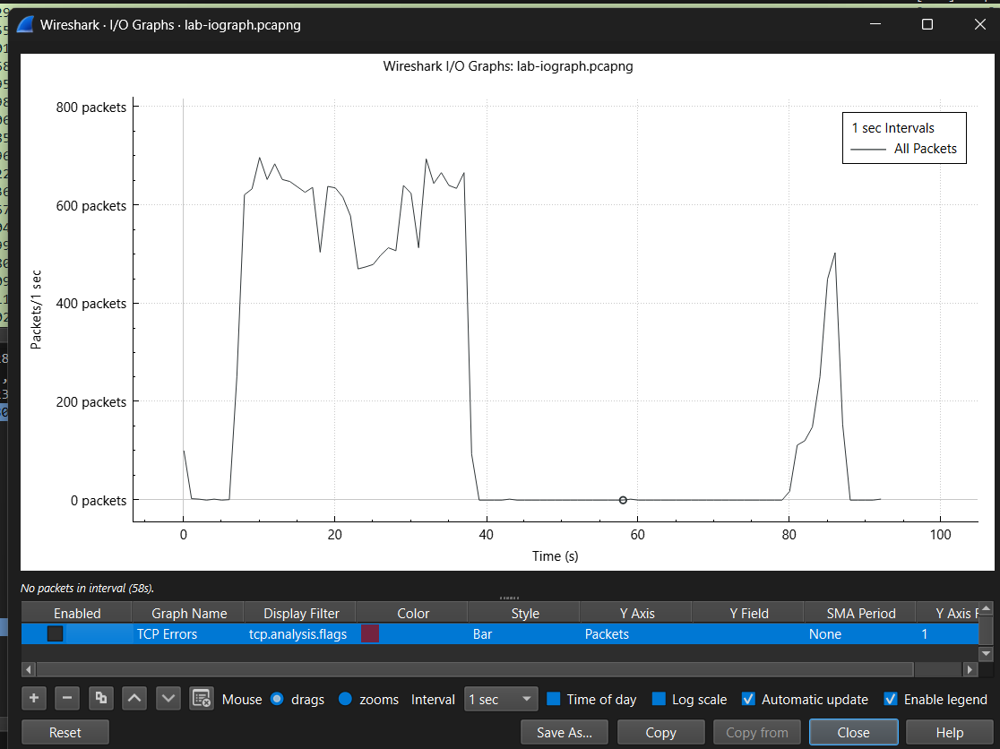

To access the I/O graph click on statistics and the option I/O Graph should be displayed. Make sure to filter out TCP errors by checking off the Enabled box to focus only on the I/O graph. To filter a specific part of the drops, click on the point of the graph where the throughput is lowest.

What types of conditions does Wireshark indicate when the throughput drops in this trace file? - Throughput drops in Wireshark trace files can be caused by different conditions, such as packet loss and buffering issues. Analyzing the highlighted packets in the trace file can help identify these conditions by checking the packet loss.

**LAB 5: Create a Coloring Rule to Detect DNS Error Responses and Suspicious DNS Responses**

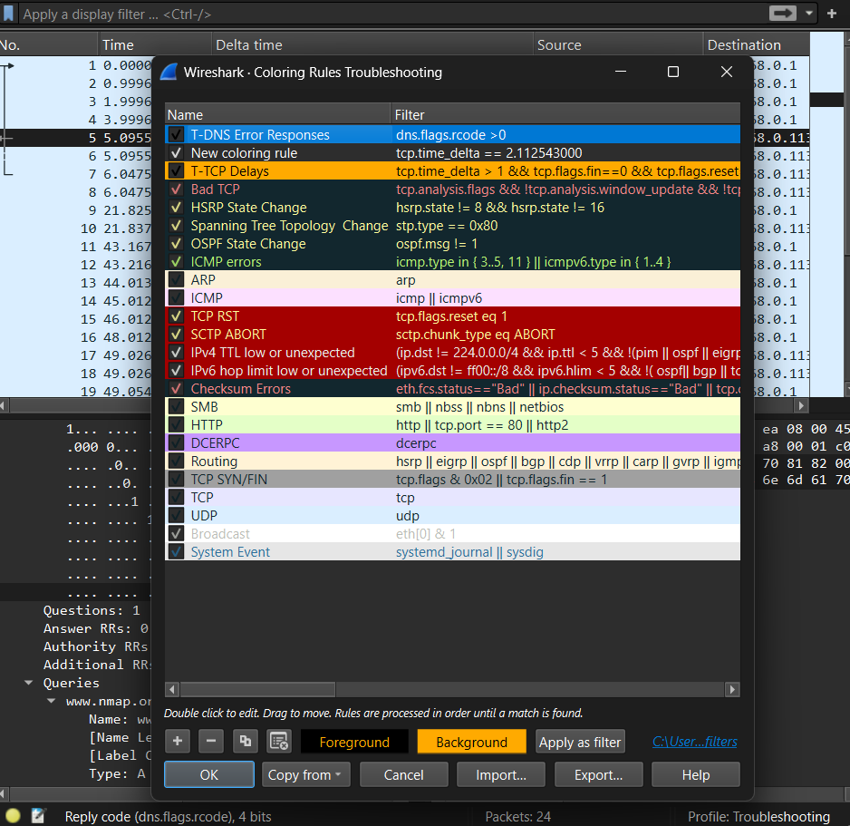

Open the lab-dns-errors-partial.pcapng file.

The file lab-sec-sickclient.pcapng will be used after colorizing the filter in the dns errors file. The color filters we change will be transferred over to the sickclient file.

Select frame 5 and right click the DNS line to expand the packet.

Find the error 0010 code and right click the code to colorize the filter. Change the settings for the rule:

-   Name: T-DNS Error Responses

-   Filter: dns.flags.rcode \> 0

-   Foreground Color: Black

-   Background Color: Orange

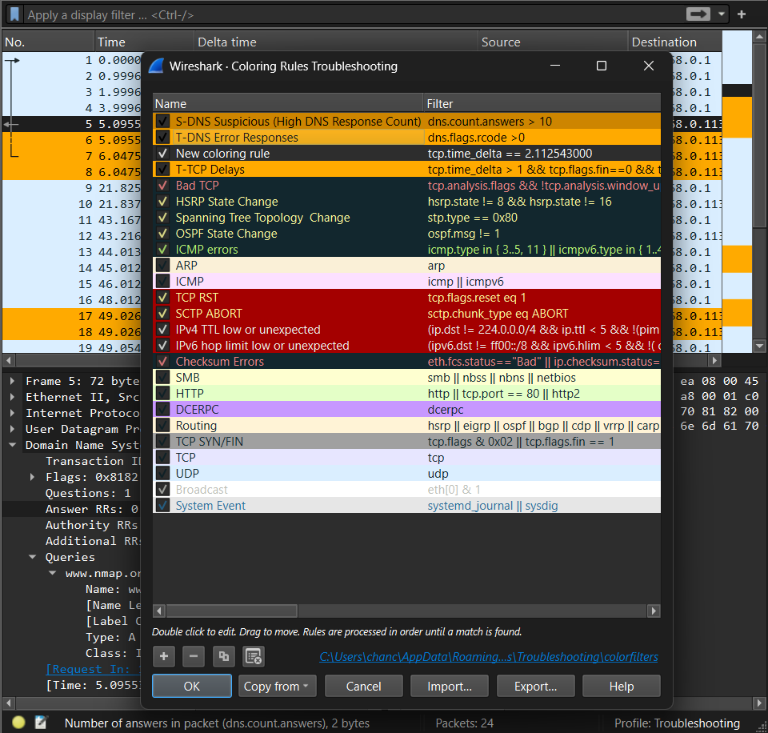

Same as the previous steps under the last Screenshot. However, go to frame 5 again and right click on the Answer RRs: 0 option to colorize with filter.

These are the new settings for the newly added filter:

-   Name: S-DNS Suspicious (High DNS Response Count)

-   Filter: dns.count.answers \> 10

-   Foreground Color: Black

-   Background Color: Dark Orange (#cd8500)

**Lab 6: Filter on a Range of IPv4 Addresses**

Use the lab-throughput.pcapng file.

To find the IP's associated with newsrss.bbc.co.uk go to the filter option and type in dns. There you should find the Ips associated with the link.

Newsrss.bbc.co.uk IP Address's: 68.87.76.182 \| 24.6.173.220

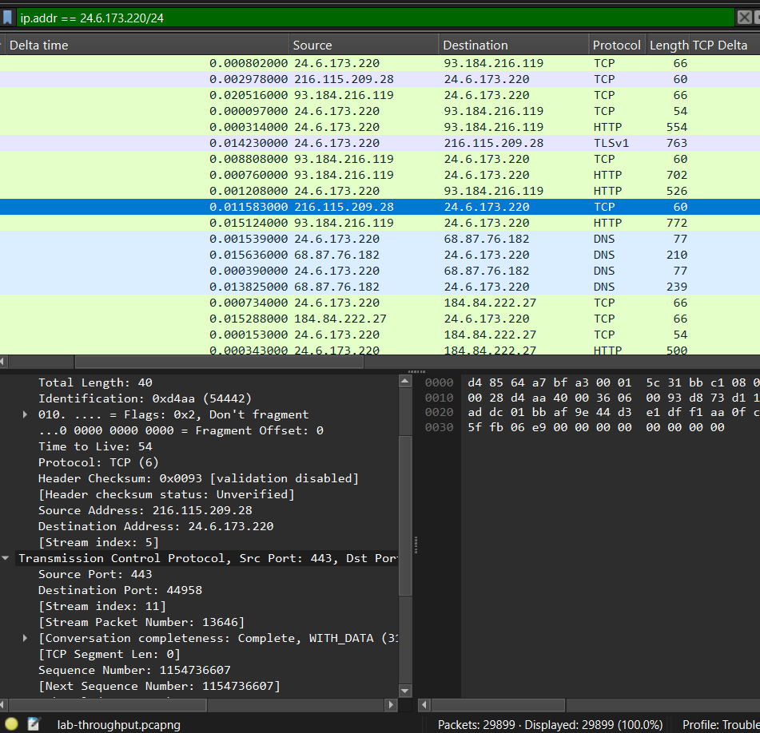

A total of 29899 packets are displayed in the filter.

After using the ip.addr == 24.6.173.220, add the ! symbol before the ip.addr to exclude the specific address in the filter. After doing this, a total of 0 packets were shown.

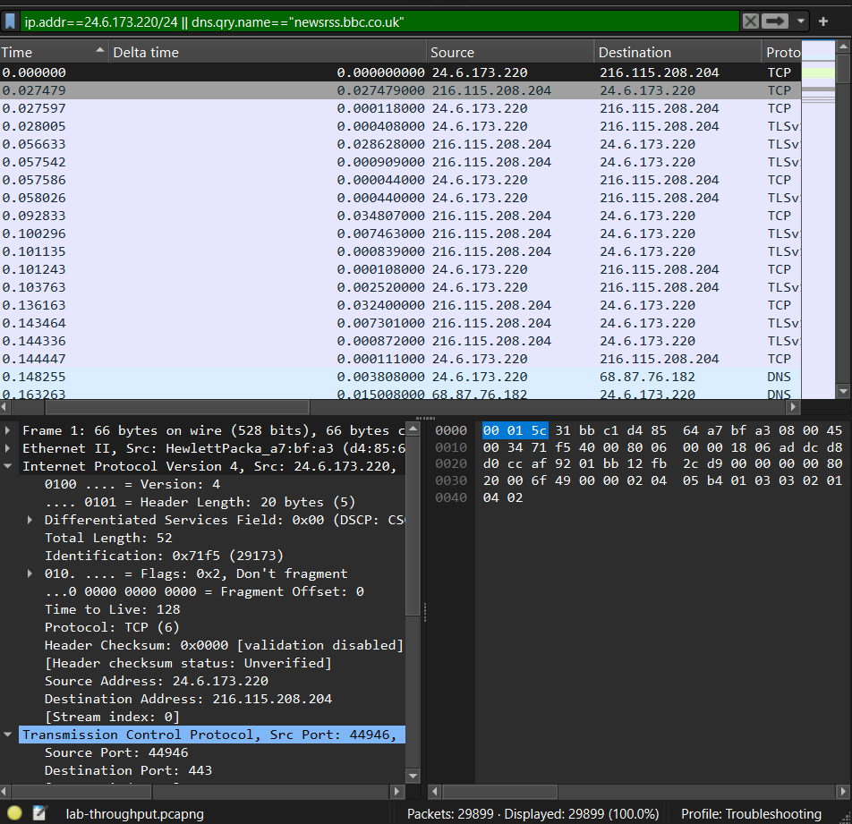

Use the filter ip.addr==24.6.173.220/24 \|\| dns.qry.name==\"newsrss.bbc.co.uk.\" The "II" in the filter is an OR, as the filter will capture the IP or the DNS. A total of 29899 Packets are displayed.
