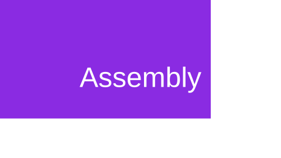
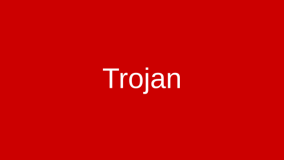

# 🦠 Malware Analysis & Reverse Engineering

Welcome to the Malware Analysis section — hands-on, safe, and reproducible labs that walk through static and dynamic reverse-engineering workflows using Ghidra and supporting tooling. Click a card t[...]

---

## Lab Projects

Below are the malware labs presented with larger visual thumbnails and short, useful detail so you can quickly find what to run next.

| Preview | Lab | Objective | Key Topics |
|---|---|---|---|
|  | [After-Action Review — Ghidra Project](aar-ghidra-project.md) | Comprehensive post‑mortem of a Ghidra reverse engineering build. | Dec[..[...]
|  | [Ghidra Analysis Practice](ghidra-analysis-practice.md) | Hands-on practice with decompilation and pseudocode interpretation. | Op[...]
|  | [Trojan Executable Guide](trojan-exe-guide.md) | Step‑by‑step guide to safely analyze trojan binaries in an isolated environment. [...]

---

## Lab Overview

Each lab contains:

- Clear objective and prerequisites
- Step-by-step setup and execution instructions
- Expected outputs and verification steps
- Example commands, extraction scripts, and analysis screenshots
- Post-lab exercises and references for deeper study

Tip: Run labs inside isolated VMs or a controlled test network. Create snapshots before making persistent changes so you can revert quickly.

---

## How to Use

1. Choose a lab from the list above and click the title to open it.
2. Read the prerequisites and ensure required tools are installed (e.g., Ghidra, radare2, a disposable VM or sandbox environment).
3. Follow the step-by-step instructions; capture outputs (exported project files, screenshots, pcaps, logs).
4. Use the "Expected Results" or "Analysis" sections in the lab to verify your findings and learn from any differences.

Pro tip: Keep lab artifacts (exported Ghidra projects, pcaps, logs) in a separate folder (e.g., malware/artifacts/) so you can reference them later.

---

## What's Included

- Detailed methodology for safe static and dynamic analysis
- Example commands, extraction scripts, and analysis screenshots
- Indicators of compromise (IOCs) and hunting queries
- Recommendations for containment and remediation

---

## Safety

All samples and analysis are performed in isolated, disposable environments (VMs or sandboxes). Never run untrusted binaries on production systems.

---

[← Back to Main Portfolio](../README.md)
