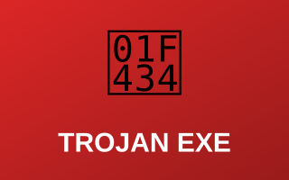

# 🦠 Malware Analysis Projects

Reverse engineering and malware analysis projects using Ghidra and other analysis tools. These projects demonstrate the ability to analyze malicious code and understand attack mechanisms.

---

## Analysis Projects

| Preview | Project |
|:---:|---|
|  | **[🔎 After-Action Review (AAR) — Ghidra Project](aar-ghidra-project.md)** Comprehensive after-action review of a Ghidra reverse engineering project with detailed findings and lessons learned.  `Reverse Engineering` `Code Analysis` `Vulnerability ID` `Lessons Learned`  **[Open Report →](aar-ghidra-project.md)** |
|  | **[🧩 Ghidra Analysis Practice](ghidra-analysis-practice.md)** Practical exercises in using Ghidra for static code analysis and binary decompilation.  `Ghidra Workflow` `Assembly Analysis` `Function ID` `Decompilation`  **[Open Report →](ghidra-analysis-practice.md)** |
|  | **[🐴 Trojan Executable Guide](trojan-exe-guide.md)** Step-by-step analysis of trojan executables, including infection vectors and behavioral analysis.  `Trojan Behavior` `String Extraction` `API Tracking` `Remediation`  **[Open Report →](trojan-exe-guide.md)** |

---

## 📋 Methodology

1. **Static Analysis** — Examine binary structure, strings, and metadata
2. **Code Decompilation** — Use Ghidra to convert machine code to pseudocode
3. **Function Analysis** — Identify and analyze key functions
4. **Behavioral Assessment** — Determine malware capabilities and intent
5. **Documentation** — Record findings and indicators of compromise

> [!WARNING]
> All analysis conducted in isolated, controlled environments. No live malware execution on production systems. All samples handled according to security best practices.

---

[← Back to Main Portfolio](../README.md)
