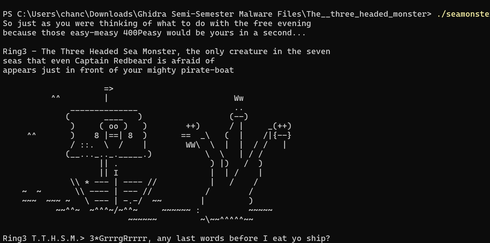
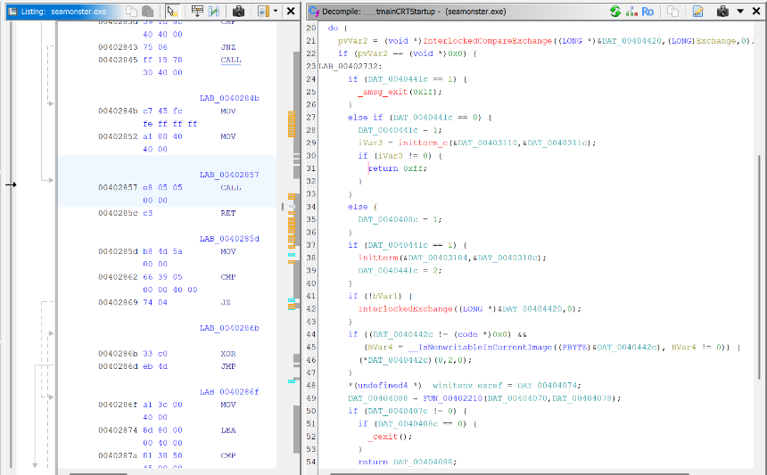
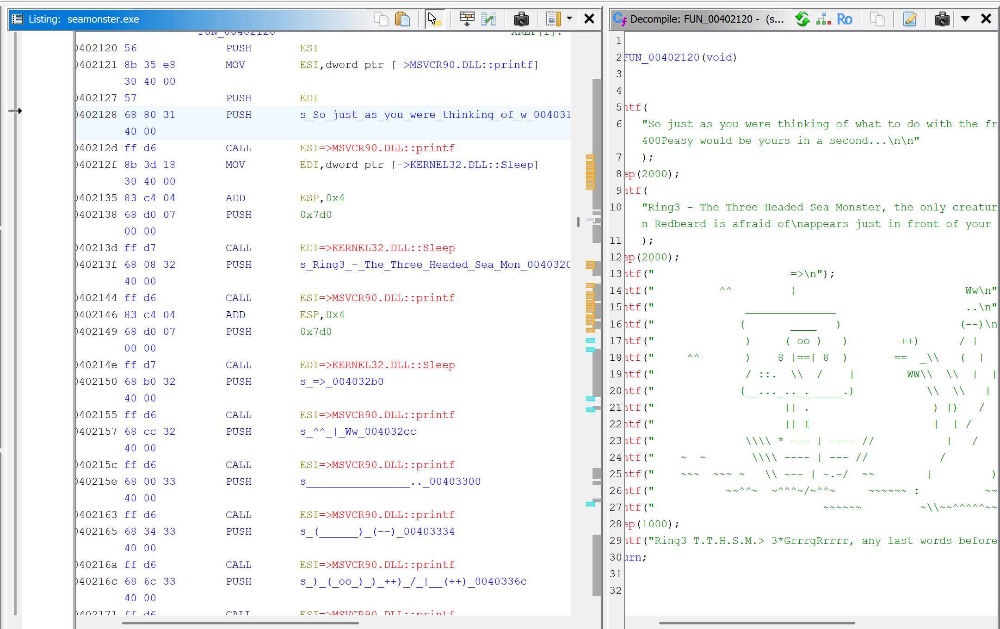
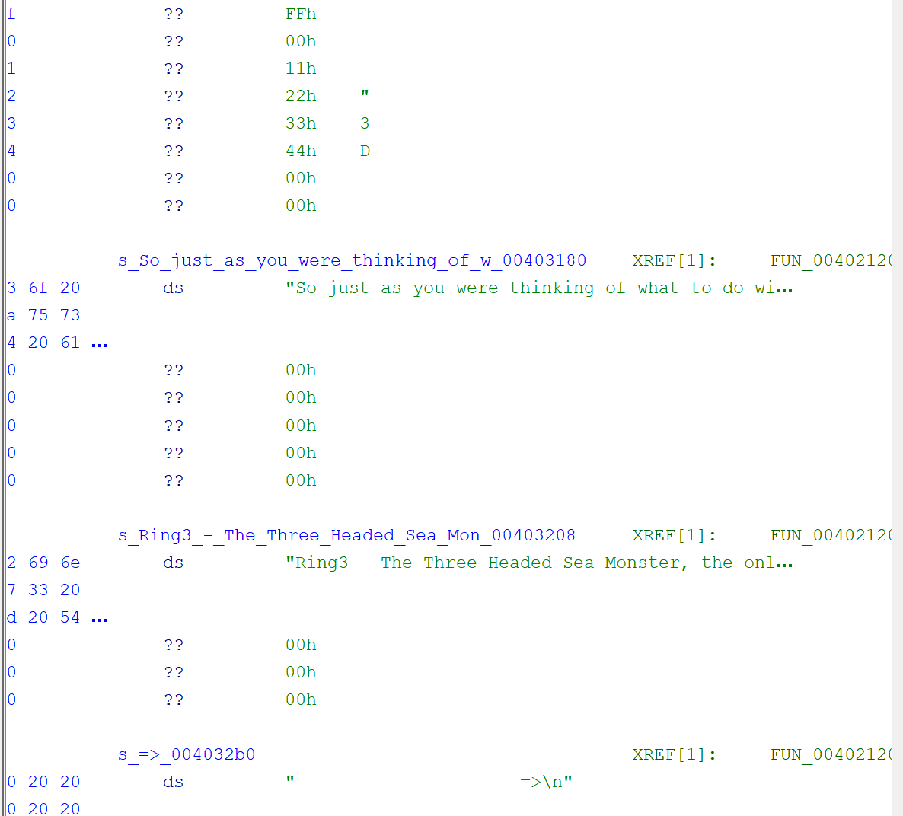
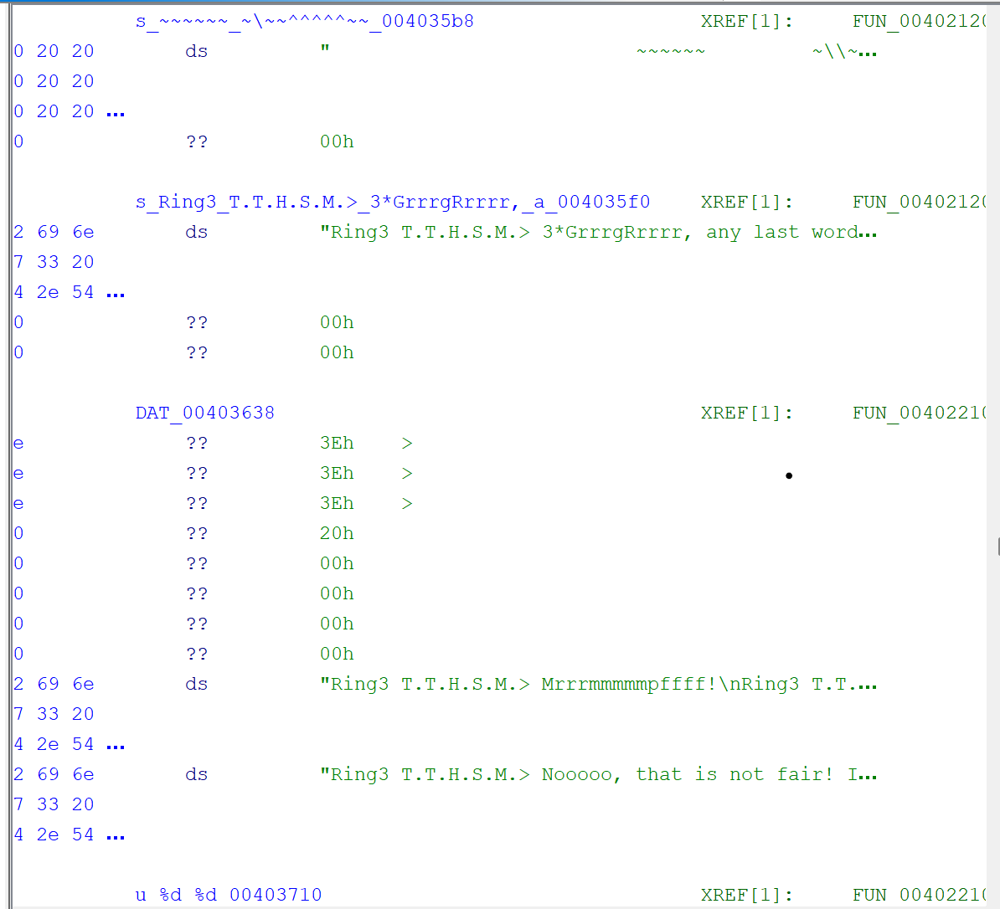
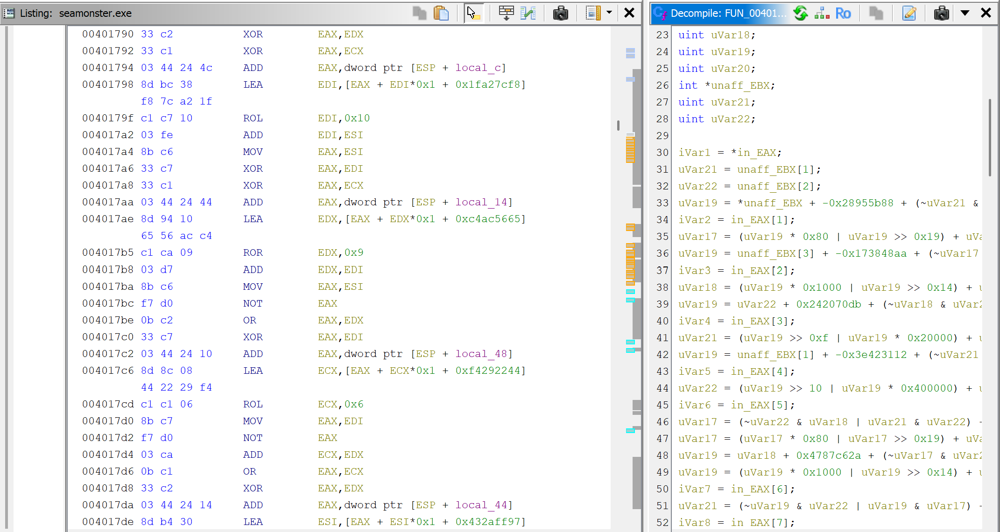

# After-Action Review: Ghidra Reverse Engineering Project

***Ghidra Semester Project***

By: Chance Debbs

shows the program's runtime output. When executed, the binary prints a multi-line narrative introducing "Ring3 -- The Three Headed Sea Monster," followed by a large ASCII monster graphic. No malicious actions. The program prints text, sleeps between lines, and then asks the user:\
"3\*GrrrgRrrrr, any last words before I eat yo ship?"

Throughout this writeup, this text will align with FUN_00402120, which handles all printing and sleep delays.

Ghidra labels internal blocks as LAB_0040xxxx. These LAB blocks are jump targets within larger functions such as FUN_00401230. In seamonster.exe, the many LAB blocks inside the routine reflect lots of looping, making the algorithm harder to follow and forcing the analyst to follow between LAB nodes rather than simple code.

This screenshot reveals the raw ASCII strings stored as static data.

-   \"So just as you were thinking of what to do with the free evening\...\"

-   \"Ring3 -- The Three Headed Sea Monster\...\"

These strings reside in memory objects named DAT_0040xxxx, showing that Ghidra automatically assigned "DAT" labels to read-only string data. The strings correlate exactly with the console output in the 1^st^ screenshot. This proves the output is hard-coded, not dynamically fetched or constructed from outside resources.

This screenshot shows the ASCII monster art stored inside the rdata and more narrative text.

-   \"Ring3 T.T.H.S.M. \> Mrrrrmmmmpffff!\"

-   \"Nooooo, that is not fair!\"

These align to the monster's printed by FUN_00402120.\
This screenshot confirms that the entire monster sequence is embedded directly in static data tables.

This screenshot is the most important technically. It shows:

-   A long function full of XOR, ROL, ROR, AND, OR, ADD, and large hexadecimal constants.

-   Multiple temporary variables (uVar18, uVar19, etc.).

-   Bit-manipulation loops resembling a custom hash or block transformation routine.

This function is not used for printing. It performs internal data mixing and obfuscation, likely designed to hide something or manipulate internal programming.

**Purpose of the Malware**

Based on all observations, seamonster.exe is not malicious malware. The visible output is a story printed out. The hidden transformation functions implement a multi-stage data-scrambling algorithm. This exe was created to teach how to read complex arithmetic and bit operations.

**Programming Languages Identified**

**C Language (main program logic)**

The structure, function prototypes, and use of C standard libraries show that the program was written in C.

**Assembly (post-compilation / internal representation)**

Ghidra shows assembly instructions such as XOR, ROL, PUSH, and CALL. These show because the C program becomes machine code.

**Microsoft Visual C Runtime**

Functions like:

-   \_\_\_security_init_cookie

-   \_initterm

-   MSVCR90.dll:printf

**Network Communications/Network Signatures**

-   No calls to socket, connect, WSAStartup, InternetOpen, or any network library.

-   No HTTP strings, IP addresses, URLs, or DNS queries.

-   No binary indicators of TCP/UDP usage.

**Author / Developer Attribution**

-   \*The file path that was found in the exe was " c:\\\\Users\\\\Felix\\\\Reversing\\\\Projects\\\\hack1u\\\\ring3\\\\Release\\\\Ring3.pdb" where in the file had the user Felix indicating that the author of the challenge is named Felix.

-   It uses Visual Studio and C runtime initialization functions.

-   The code resembles instructional or challenge material.

-   This executable was created by a developer designing a reverse-engineering challenge.

**Reverse Engineering Steps Taken**

**Step 1 --- Initial Triage & Execution**

1.  Executed *seamonster.exe* in a safe environment.

2.  Observed the ASCII art, printed story text, and no malicious actions.

3.  Noted that execution paused due to Sleep() calls and ended without prompting input.

**Step 2 --- Load the Binary into Ghidra**

1.  Imported seamonster.exe into Ghidra.

2.  Let Ghidra analyze:

    -   Function signatures

    -   Data references

    -   Control flow

3.  Observed autogenerated function names (FUN_0040xxxx, LAB_0040xxxx, DAT_0040xxxx).

**Step 3 --- Identifying Strings**

1.  Opened the **Strings** window.

2.  Found the entire story text:

    -   Monster dialogue

    -   Narrative introductions

    -   ASCII art

3.  Cross-referenced these strings to FUN_00402120.

**Step 4 --- Mapping Output Behavior to Code**

1.  Opened FUN_00402120.

2.  Decompiler showed multiple printf() and Sleep() calls.

3.  Verified every printed line corresponded to a specific DAT_0040xxxx address.

**Step 5 --- Discovering Hidden Algorithmic Behavior**

Revealed FUN_00401230, containing:

-   arithmetic operations

-   XOR-based diffusion

-   Multiple working registers

-   Heavy use of local variables

**Step 6 --- Tracing Data Flow**

1.  Located calls to FUN_00401230.

2.  Found a wrapper function performing:

    -   Buffer splitting

    -   Byte extraction

    -   Data recombination

    -   Writing transformed bytes back into memory.

**Step 7 --- Identifying Global Data**

1.  Examined. rdata for constants and strings.

2.  Found:

    -   Story text

    -   ASCII art

    -   Message formatting

    -   Mixing tables for the hash-like function

**Step 8 --- Searching for Network Behavior**

1.  Inspected import table.

2.  No networking functions were imported.

**Step 9 --- Final Behavior Determination**

After examining all functions:

-   Only printing & sleeping occurs externally.

-   All internal complex transforms are self-contained.

-   No malicious actions happen.

**Conclusion**

The *seamonster.exe* is a non-malicious reverse-engineering challenge. Its purpose is limited to printing a storyline and ASCII art. Several functions exist that appear intentionally obfuscated, likely to teach how to inspect compiled C code, trace data flow, and understand Ghidra's FUN/LAB/DAT structure.
