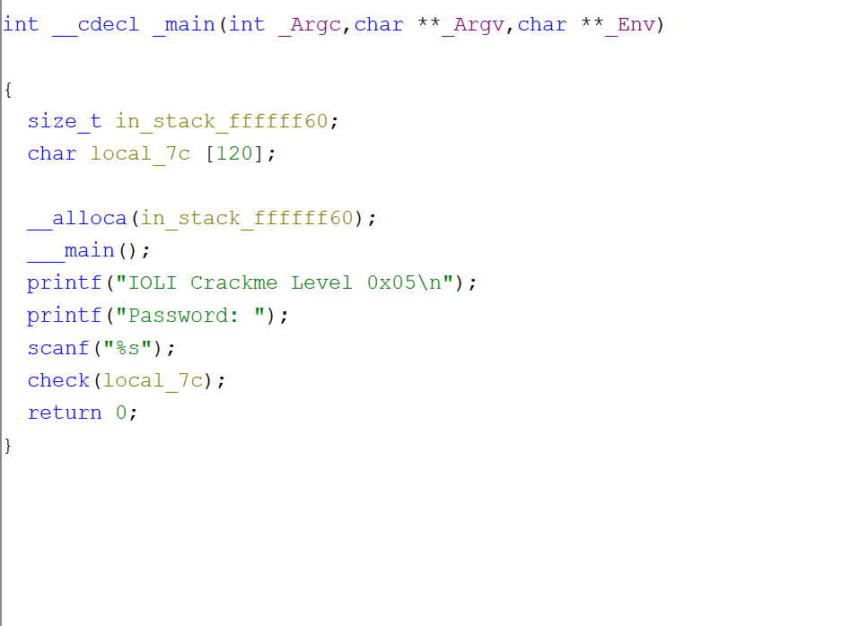
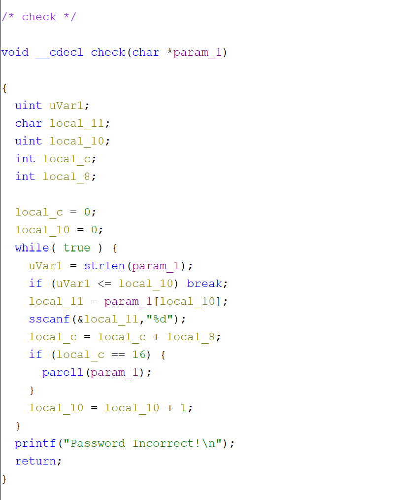
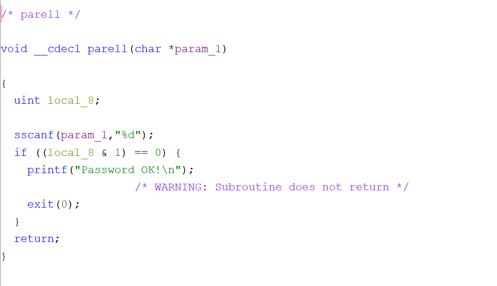
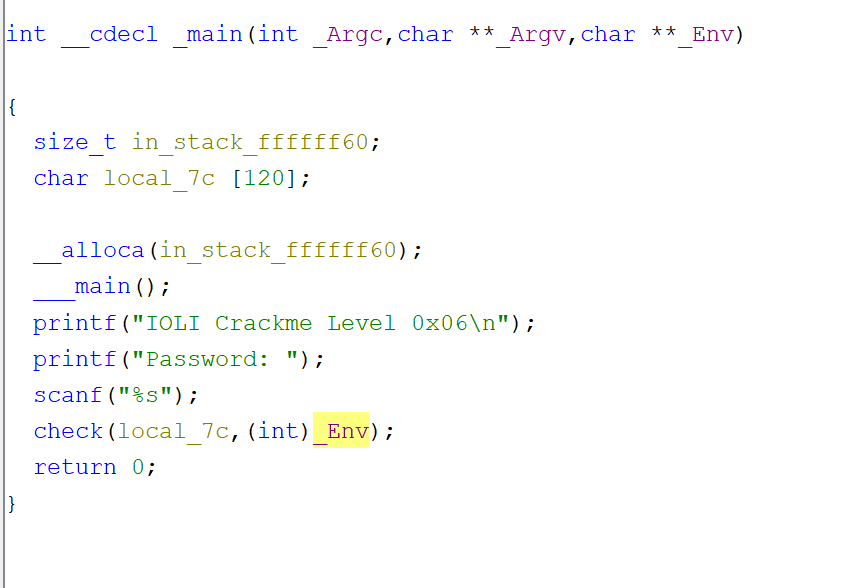
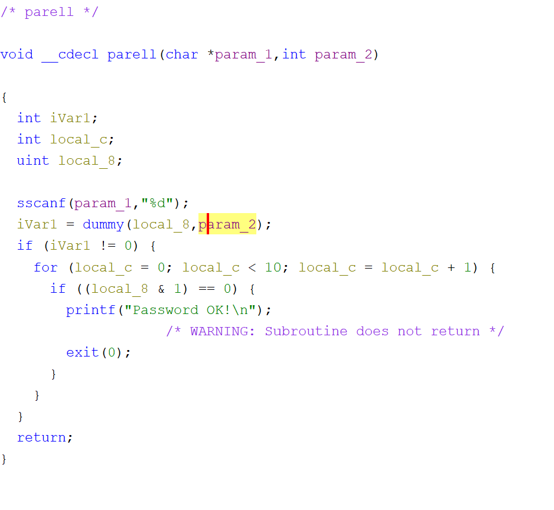
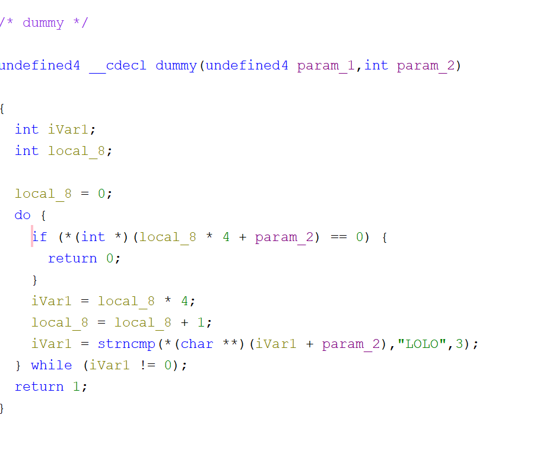
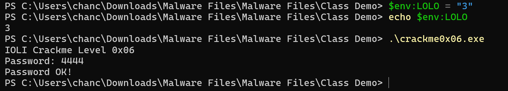

# Ghidra Analysis Practice — CrackMe Challenges

**CrackMe Assignments**

**CRACKME0x05**

-   It reads your password input as a string and passes it to check(local_7c).

-   Check for the sum to equal 16.

-   If true, it forwards the param_1 to parell.

-   If the sum hits 16 but the number is **odd**, parell returns, the loop ends, and check() prints "Password Incorrect!".

-   This function checks whether the entered number is even ((local_8 & 1) == 0).

-   If it's even and equals 16, it prints "Password OK!"

**CRACKME0x06**

**This is the same as crackme0x05, but with a twist to it.**

-   This is the main entry, however an \_Env is added to the check function.

-   Found the password OK section to see what I need to do and spotted a dummy function

-   The dummy code requires you to have an environment set up and run the crackme0x06. Just like crackme0x05 the requirement needs to be even numbers that equal to 16.

-   This is the setup used for me to figure out the crackme assignment.
