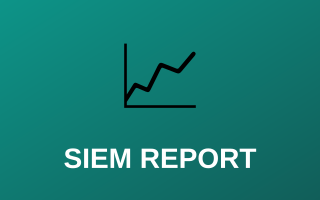
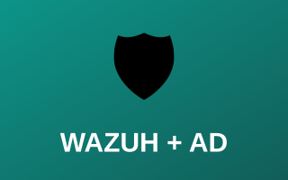

# 📊 Reports & SIEM Analysis

Comprehensive security reports including SIEM platform analysis, security event investigation, and active response documentation.

---

## SIEM & Security Reports

| Preview | Project |
|:---:|---|
|  | **[📈 Final SIEM Report](final-siem-report.md)** Comprehensive analysis of security events captured and analyzed through a SIEM platform.  `SIEM Setup` `Log Aggregation` `Event Detection` `Alert Tuning` `Executive Summary`  **[Open Report →](final-siem-report.md)** |
|  | **[🛡️ Wazuh Active Response & AD Lab Report](wazuh-active-response.md)** Implementation and testing of automated threat response using Wazuh with Active Directory integration.  `Wazuh Architecture` `AD Integration` `Automated Response` `Alert Correlation`  **[Open Report →](wazuh-active-response.md)** |

---

## 📈 SIEM Capabilities Demonstrated

- **Event Collection & Analysis** — Real-time log ingestion, centralized storage, correlation
- **Threat Detection** — Rule-based & anomaly detection, alert tuning, false positive reduction
- **Incident Response** — Timeline reconstruction, root cause analysis, automated response actions
- **Reporting & Compliance** — Executive dashboards, audit trails, KPI tracking

---

[← Back to Main Portfolio](../README.md)
