# Final SIEM Report

**Final Siem Report**

By: Chance Debbs

**Graylog, Suricata & Zeek Analysis**

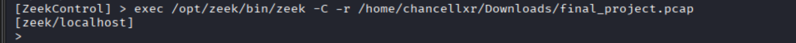

-   To get the file to run for graylog, I entered the zeekctl terminal and used this command to run the pcap file on Zeek.

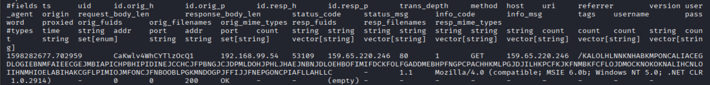

-   This Zeek log captures an outbound HTTP GET request from a local host to port 80, containing a long, encoded URI consistent with malware beaconing behavior. The request includes metadata such as method, host, URI, and user-agent, confirming Zeek successfully parsed and recorded the transaction. This traffic likely represents a custom encoded beacon used for C2 communication. The log validates that Zeek is actively monitoring and logging suspicious HTTP activity for further analysis.

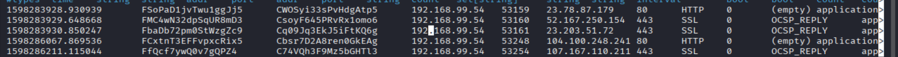

-   The Zeek log snippet shows outbound connections from the host to multiple IPs over HTTP and SSL, with entries showing OCSP status checks during TLS handshakes. These records record timestamps, unique Zeek connection IDs, and protocols useful for investigating network activity.

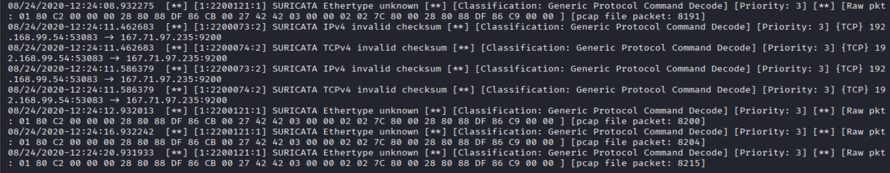

-   captures Suricata alerts triggered during analysis of a pcap file containing suspected C2 beacon traffic. The ethernet unknown messages could mean there are malformed or obfuscated packets, often used by malware to evade detection. The consistent timestamps and identical payloads indicate beaconing behavior that's automated. These signs point to a likely C2 channel attempting to maintain stealth while probing or signaling across the network.

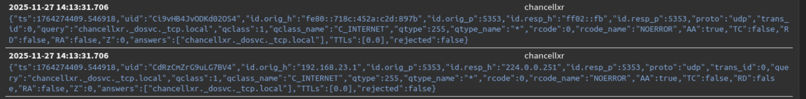

-   In graylog, this is how beaconing can start. Now that Zeek has parsed it, Filebeat can forward it, and Graylog can help spot patterns or suspicious behavior.

**Wireshark Analysis**

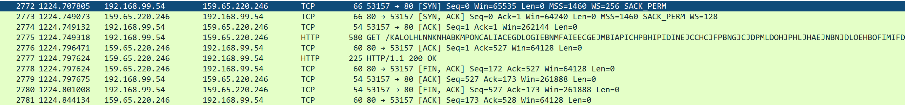

-   This Wireshark capture shows a successful TCP handshake followed by an HTTP GET request to download from. The URI includes multiple embedded IP parameters, which may be used for host tracking or beaconing. If this traffic is associated with a suspected C2 implant, the structured GET request and executable download suggest the malware is reaching out to a C2 server to retrieve payloads or register the infected host. This pattern is consistent with initial staging or callback behavior in C2 infrastructure.

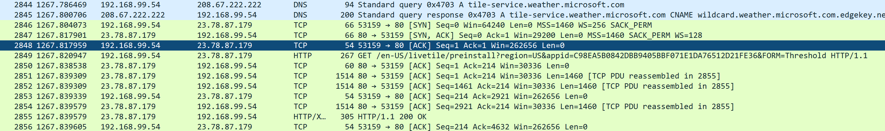

-   This piece of the Wireshark file includes a HTTP GET request for a preinstall package, specifically targeting, with a URI containing multiple embedded IP parameters and a suspicious value. The presence of a non-standard or obfuscated in the request may indicate beaconing behavior, commonly used in C2 frameworks to uniquely identify infected machines. This pattern suggests the malware is attempting to retrieve a payload or register itself with the C2 infrastructure under the guise of a legitimate software update.

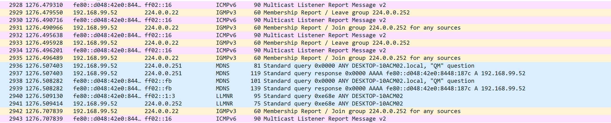

-   This packet capture shows multicast and mDNS activity involving an IP, which appears to be actively participating in service discovery and local name resolution. The system is sending and responding to queries, suggesting it's showing its presence and possibly listening for inbound traffic. This behavior may indicate that the host is configured to intercept or monitor multicast traffic, potentially to relay system or network metadata. It could be leveraging local service broadcasts to identify nearby hosts or exfiltrate information covertly.

**Wireshark Analyzer Software**

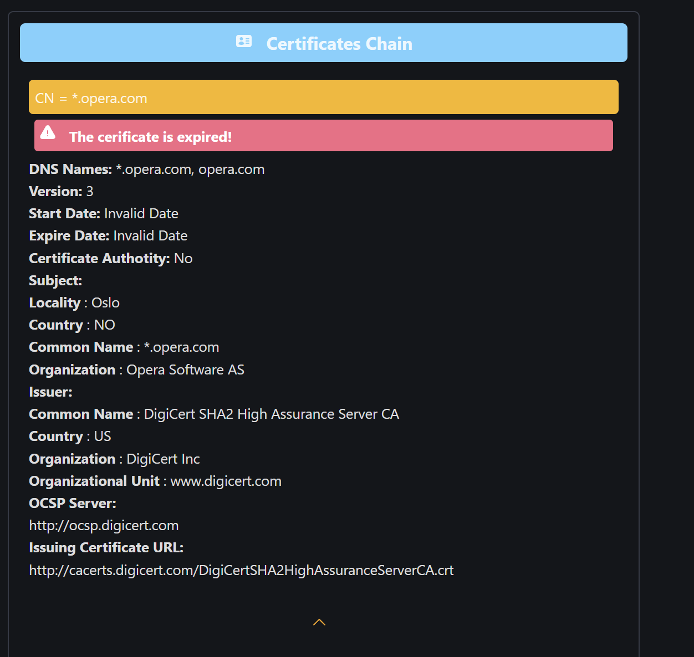

-   Opera had an expired certificate with no issuer being displayed so there's no information on who provided the opera software. This could also mean the user installed the browser from a shady site and could be a victim of a supply chain attack.

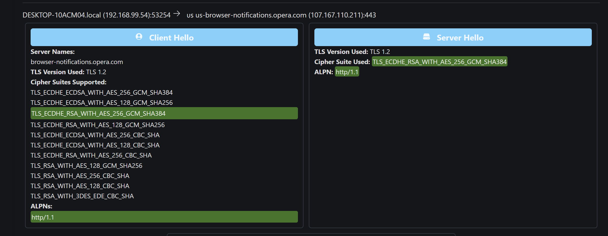

-   Put it in a packet analyzer and realized the communication had a http/1.1 which is the same as the obfuscated GETREQUEST KALOL which ends with "http/1.1." This could indicate that the long masked url is intercepting the communication of the opera browser and hiding out to listen to other communications the user will partake in.

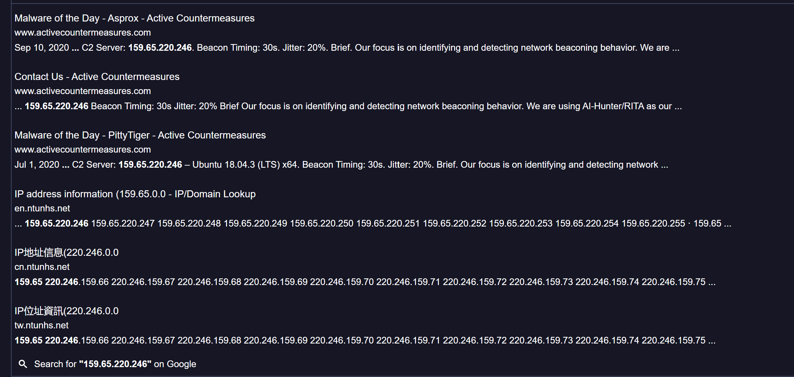

-   The IP 159.65.220.246 belongs to DigitalOcean which is a cloud infrastructure that is mainly used by threat actors to begin C2 attacks.

> **Additional Information**

-   File Name: Final_project.pcap

-   When was it developed: The packet capture 1^st^ started August 24, 2020

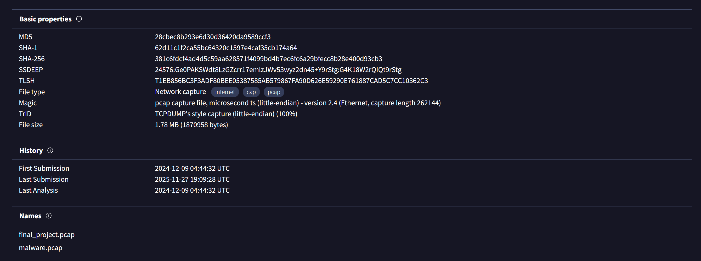

Also looked it up in virustotal to get a look and the 1^st^ time it was put in the analyzer 9/12/2024 and the previous name was malware.pcap. This shows that this packet capture is malware logs recorded in Wireshark.

-   What type of malware does this fall under: **C2**

-   What it's purpose of the malware: The malware is a C2 backdoor implant used to register infected hosts with the attacker's infrastructure, identify them by campaign, and await further commands.

-   Who is the creator: The creator is in the GETREQUEST starting with the long-obfuscated string starting with KALOL. I believe that the long list of strings was obfuscated more than once making it difficult for it to be decoded.

-   IP Address Information

    -   159.65.220.246 is the http source of the get request to send beacon

    -   DESKTOP-10ACM04.local (192.168.99.54) is the attacker IP

    -   107.167.110.216 & 107.167.110.211 are both opera browsers that were infected and relay information to the C2 server.

-   Ports Used (if available)

    -   80 (HTTP): Used for beacon traffic and payload retrieval.

    -   53 (DNS): Standard DNS queries to the local resolver.

    -   5353 (mDNS): Multicast service discovery queries.

    -   443 (HTTPS): Observed in related traffic, possibly for encrypted communication.

    -   7680 (pando‑pub): Non‑standard port observed, potentially used for staging or secondary communication.

**Summary Report**

The analysis of the file reveals a malware sample functioning as a C2 backdoor implant. Its behavior includes beaconing HTTP GET requests with obfuscated data, multicast DNS queries for local discovery, and communication with attacker infrastructure hosted on DigitalOcean. The infected host generated repeated requests, registering itself with the C2 server and awaiting commands.

Its classification as a Trojan/backdoor is supported by its persistence and communication patterns. By leveraging Zeek, Wireshark, Suricata, and Graylog, and additional software tools, the investigation documented the malware's infrastructure, ports, and behavior in detail. Understanding this malware's behavior is critical for defenders. Beaconing traffic can be detected by analyzing URI length, frequency of requests, and embedded parameters. Multicast DNS queries with unusual names can indicate host registration attempts. Cloud infrastructure IPs such as DigitalOcean should be monitored for suspicious activity. By correlating logs across Zeek, Suricata, and Graylog, defenders can build detection rules that flag repeated beacon intervals, encoded URIs, and suspicious DNS queries. Suricata rules can be written to trigger on unusual strings or parameters. Zeek scripts can be used to extract and log suspicious URIs.

This analysis demonstrates the importance of structured workflows in malware detection. By correlating logs across multiple tools and visualizing patterns in a SIEM, analysts can uncover hidden beaconing activity and attribute malware to specific campaigns. The findings highlight how attackers use cloud infrastructure, obfuscation, and service discovery to maintain C2 channels, and how defenders can detect and disrupt these operations through careful packet analysis.
