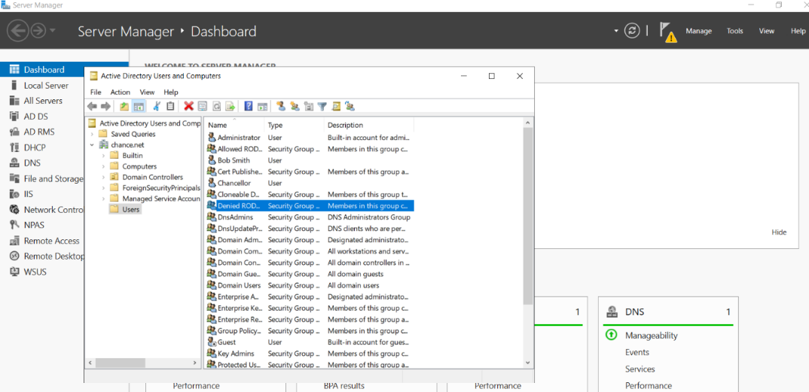
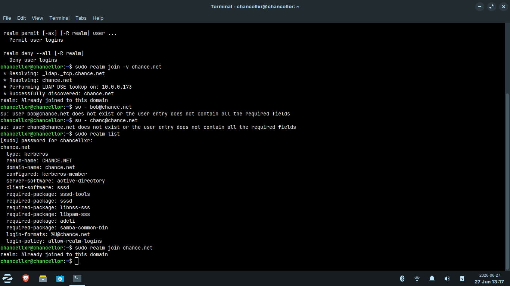
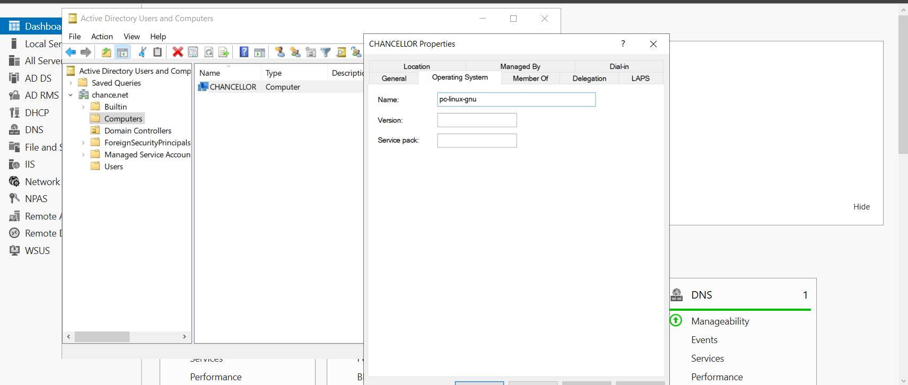
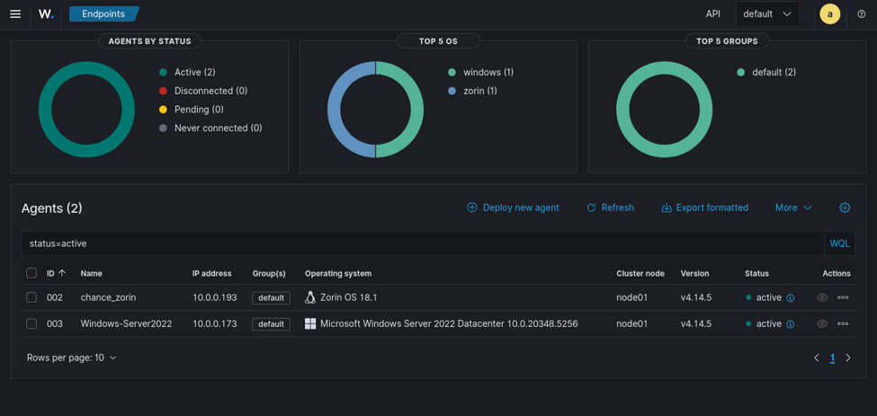
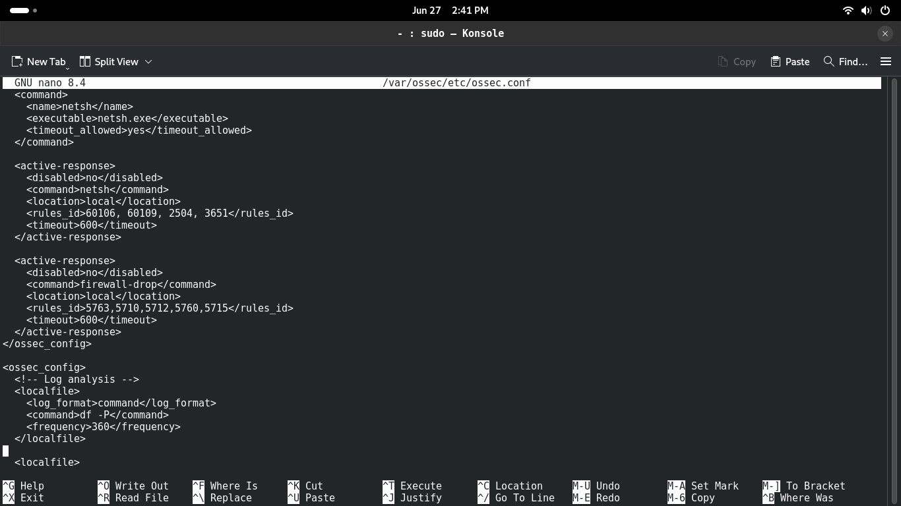
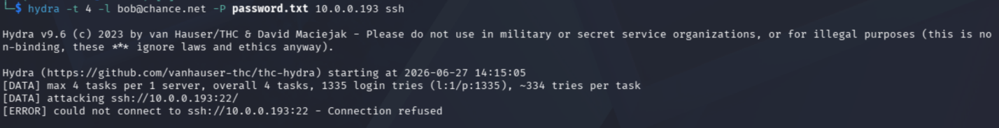
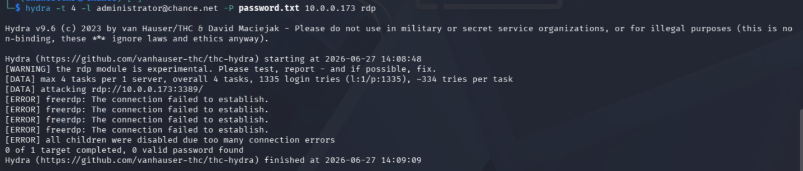
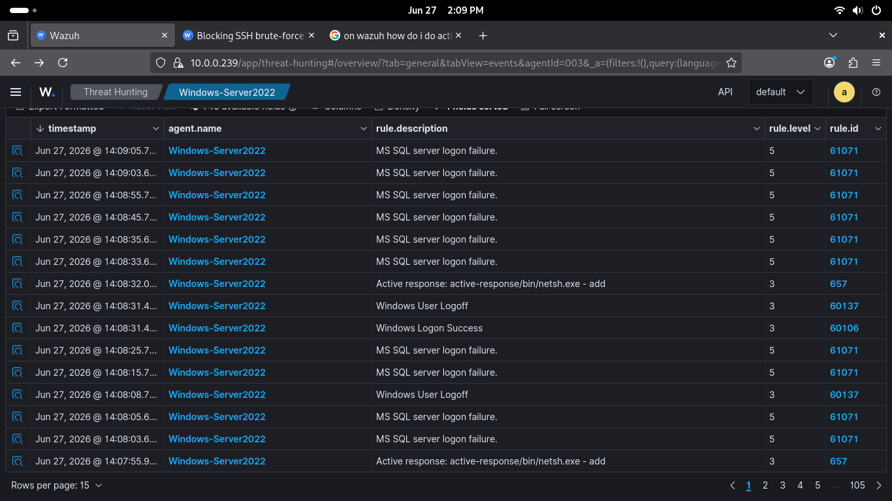
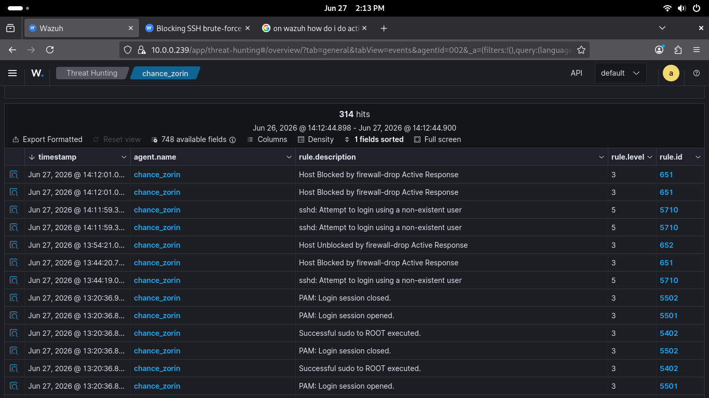

# Wazuh Active Response & Active Directory Lab Report

**WAZUH ACTIVE RESPONSE + ACTIVE DIRECTORY LAB**

*Cross-Platform Threat Detection & Automated Response*

*Active Directory Integration with Linux Domain Join*

By: Chance Debbs

Date: June 27, 2026

# **Executive Summary**

This lab demonstrates an advanced security operations setup combining Active Directory domain management with cross-platform threat detection using Wazuh. The infrastructure integrates Windows Server 2022 with a Linux machine joined to the same Active Directory domain, creating unified security monitoring across endpoints.

**Key Highlights:**

-   Successfully configured Active Directory with Windows Server 2022 domain controller (chance.net)

-   Domain-joined Linux machine (Zorin OS) to Active Directory for centralized authentication

-   Deployed Wazuh agents on both Windows and Linux endpoints for unified monitoring

-   Detected and responded to both SSH and RDP brute-force attacks in real-time.

-   Demonstrated automated incident response with Active Response rules (netsh firewall commands)

# **Lab Objectives**

1.  Establish a Windows Server 2022 Active Directory domain with proper authentication controls.

2.  Configure and domain-join a Linux system to Active Directory

3.  Deploy Wazuh agents on both Windows and Linux endpoints.

4.  Configure Wazuh Active Response rules for automated threat mitigation.

5.  Simulate realistic SSH and RDP brute-force attacks.

6.  Demonstrate centralized monitoring and threat hunting across heterogeneous infrastructure.

# **Active Directory Infrastructure**

Active Directory serves as the centralized identity and access management system for the lab environment. The Windows Server 2022 domain controller manages user accounts, security groups, and computer objects for the chancenet.com domain. This provides unified authentication and authorization across all systems, including the domain-joined Linux machine.

## **Active Directory Users and Computers**

*Figure 1: Active Directory Users and Computers -- Chance.net domain showing user accounts, security groups, and domain infrastructure.*

The Active Directory domain contains multiple user accounts and security groups configured for role-based access control. These include domain administrators, DNS administrators, and various security groups that enforce organizational policies across all domain-joined systems. The structure provides a foundation for consistent security policy implementation.

# **Linux Domain Join Configuration**

The Linux machine was successfully domain-joined to Active Directory using SSSD (System Security Services Daemon) and Kerberos. This configuration allows the Linux system to authenticate users against the AD domain and apply domain-based access policies.

*Figure 3: Linux Realm Join Process - Terminal output showing successful domain integration with SSSD and Kerberos configuration.*

The terminal output demonstrates the successful realm join process:

-   Command executed: sudo realm join -v chance.net

-   LDAP and DNS lookups resolved to AD server (10.0.0.173)

-   SSSD configured as Kerberos-member for authentication.

-   Active Directory server-software identified.

-   Confirmation: \"realm: Already joined to this domain\"

With this configuration in place, domain users can now SSH into the Linux system using their Active Directory credentials. Authentication is handled through SSSD, which communicates with the AD domain controller for credential verification.

## **Linux System in Active Directory**

The Linux machine is registered as a computer object in Active Directory. This enables centralized user management and allows domain users to authenticate to the Linux system.

*Figure 2: CHANCELLOR Computer Object - Linux system registered in Active Directory as a domain member (pc-linux-gun)*

The CHANCELLOR computer object (pc-linux-gun) appears in the domain directory, allowing the Linux system to participate in domain authentication mechanisms. This integration enables domain users to log in to the Linux system using their Active Directory credentials.

# **Wazuh Deployment & Monitoring**

Wazuh agents were deployed on both the Windows Server 2022 domain controller and the domain-joined Linux system. These agents collect security events, system logs, and network activities, forwarding them to the central Wazuh manager for analysis and threat detection.

*Figure 4: Wazuh Endpoints Dashboard - Two active agents monitoring the AD-integrated infrastructure.*

The Wazuh dashboard shows both agents in Active status:

-   **Agent 002: chance. Zorin** (Linux/Zorin OS 18.1, IP: 10.0.0.193) - Domain-joined Linux system

-   **Agent 003: Windows-Server2022** (Windows Server 2022 Datacenter, IP: 10.0.0.173) - AD domain controller

Both agents are connected and actively report to the Wazuh manager. This unified agent deployment enables Wazuh to collect and correlate security events from both Windows Event Logs and Linux system logs, providing complete visibility across the entire AD-integrated infrastructure.

# **Wazuh Configuration & Active Response**

Wazuh Active Response was configured with custom rules and actions to automatically respond to security threats detected on both Windows and Linux endpoints. When suspicious activity is detected, the system automatically executes predefined commands to mitigate the threat.

*Figure 5: OSSEC Configuration - Active Response rules for automated firewall and threat mitigation actions*

# **Attack Simulation & Results**

## **SSH Brute-Force Attack (Domain-Joined Linux)**

An SSH brute-force attack was simulated against the domain-joined Linux system using Hydra, attempting to guess Active Directory user credentials:

-   Target: 10.0.0.193 (chance. Zorin - Domain-joined Linux)

-   Attack Type: SSH credential guessing against AD-authenticated users.

-   Payload: password.txt wordlist with 1335 login attempts

-   Threads: 4 parallel connections (-t 4)

*Figure 6: SSH Brute-Force Attack - Hydra targeting the domain-joined Linux system with 1335 login attempts.*

## **RDP Brute-Force Attack (Windows Server)**

An RDP brute-force attack was simulated using Hydra tool against the Windows Server 2022 domain controller:

-   Target: 10.0.0.173 (Windows-Server2022 - Domain Controller)

-   Attack Type: RDP credential guessing against domain accounts

-   Command: hydra -t 4 -l administrator@chance.net -P password.txt 10.0.0.173 rdp

-   Result: Connection failed (Wazuh Active Response blocked the attack)

*Figure 7: RDP Brute-Force Attack - Hydra attempting to guess domain credentials on Windows Server 2022*

# **Threat Hunting & Detection Results**

The Wazuh dashboard successfully captured and displayed all security events from both the Windows Server 2022 domain controller and the domain-joined Linux system, demonstrating threat visibility across the entire AD infrastructure:

*Figure 8: Threat Hunting Dashboard - Real-time detection of attack events and Active Response execution*

**Key Detections & Findings:**

-   **MS SQL Server Login Failures (Rule 61071, Level 5):** Detected multiple failed authentication attempts against the domain controller.

-   **Active Response Execution (Rule 657, Level 3):** netsh.exe commands automatically executed to add firewall rules.

-   **Windows Logoff Events (Rule 60137, Level 3):** User session terminations recorded during attack period.

-   **Windows Logon Success (Rule 60106, Level 3):** Legitimate domain user access patterns successfully distinguished from attack traffic.

*Figure 9: Comprehensive Event Logging - Complete forensic audit trail of all security events across AD-integrated infrastructure*

# **Conclusion & Key Takeaways**

This lab successfully demonstrated the integration of Active Directory with modern security operations and threat detection. The combination of centralized AD authentication with Wazuh threat monitoring creates a comprehensive security posture that works seamlessly across Windows and Linux infrastructure.

**Key Achievements:**

-   Successfully domain-joined Linux system to Active Directory, enabling centralized authentication.

-   Unified security monitoring across infrastructure (Windows + Linux)

-   Real-time detection of SSH and RDP brute-force attacks against AD-integrated systems

-   Immediate automated response to mitigate threats without manual intervention.

-   Comprehensive logging and forensic analysis for post-incident investigation

-   Demonstrated that Active Response significantly reduces Mean Time to Response (MTTR)
