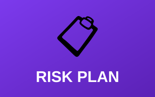

# 📋 Risk Management Projects

Comprehensive risk management assessments and mitigation strategies for mock company scenarios, demonstrating the ability to identify organizational vulnerabilities and develop remediation plans.

---

## Projects

| Preview | Project |
|:---:|---|
|  | **[📋 Final Risk Mitigation Plan](risk-mitigation-plan.md)** Enterprise-level risk assessment and mitigation strategies for a mock healthcare company.  `Risk Assessment` `Mitigation Planning` `Business Impact` `Compliance`  **[Open Report →](risk-mitigation-plan.md)** |

---

## What You'll Learn

- **Risk Assessment & Analysis** — Identification, evaluation, and prioritization of vulnerabilities and threats
- **Mitigation Strategy Development** — Actionable remediation plans and risk control measures
- **Business Impact Analysis** — Aligning security solutions with business objectives
- **Compliance & Documentation** — Proper reporting of risk assessments and remediation plans

---

[← Back to Main Portfolio](../README.md)
