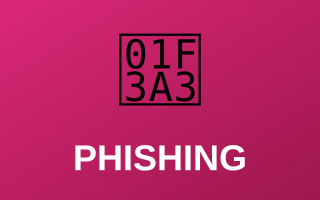
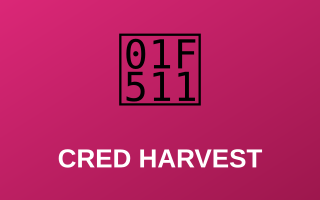
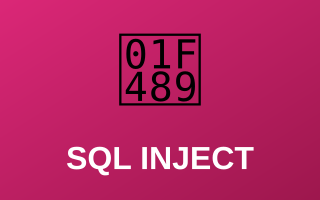

# 🎭 Attack Simulations & Security Testing

Security testing exercises including phishing campaigns, credential harvesting simulations, and SQL injection attacks — demonstrating offensive security knowledge and testing methodology.

---

## Security Testing Projects

| Preview | Project |
|:---:|---|
|  | **[🎣 Phishing Campaign Documentation](phishing-campaign.md)** Comprehensive documentation of a controlled phishing campaign for security awareness and testing.  `Campaign Planning` `Social Engineering` `Click Tracking` `Awareness`  **[Open Report →](phishing-campaign.md)** |
|  | **[🔑 Credential Harvester Simulation](credential-harvester.md)** Controlled simulation of credential harvesting attacks to test detection and response capabilities.  `Fake Auth Interface` `Traffic Capture` `Detection` `SIEM Rules`  **[Open Report →](credential-harvester.md)** |
|  | **[💉 SQL Injection Attack](sql-injection-attack.md)** Hands-on practice with SQL injection vulnerabilities and exploitation techniques in controlled environments.  `Blind & Time-Based Injection` `Database Enumeration` `Prepared Statements`  **[Open Report →](sql-injection-attack.md)** |

---

> [!IMPORTANT]
> - All simulations conducted in **authorized testing environments only**
> - No production systems targeted
> - Results used strictly for **defensive improvement purposes**

---

[← Back to Main Portfolio](../README.md)
