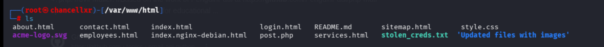
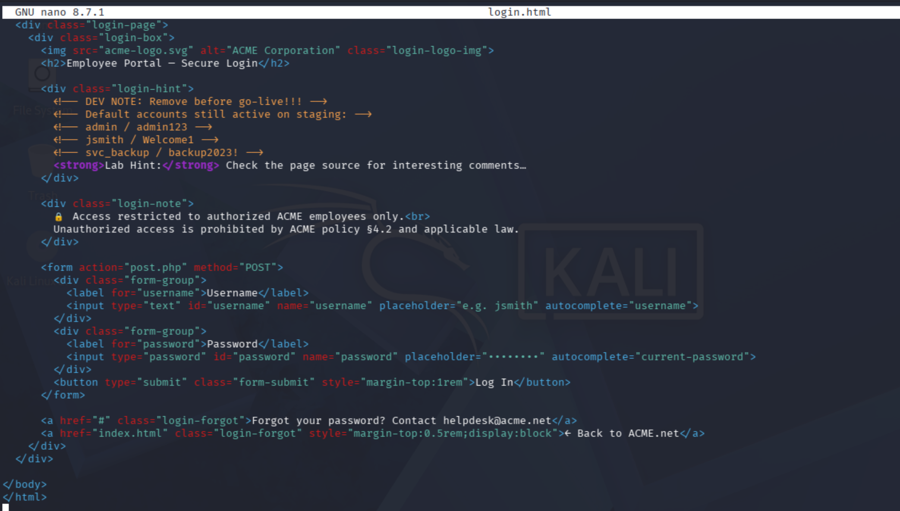
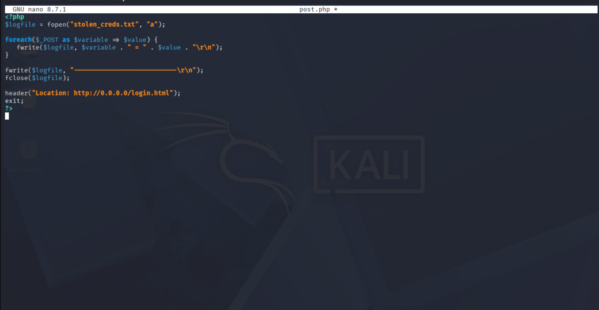
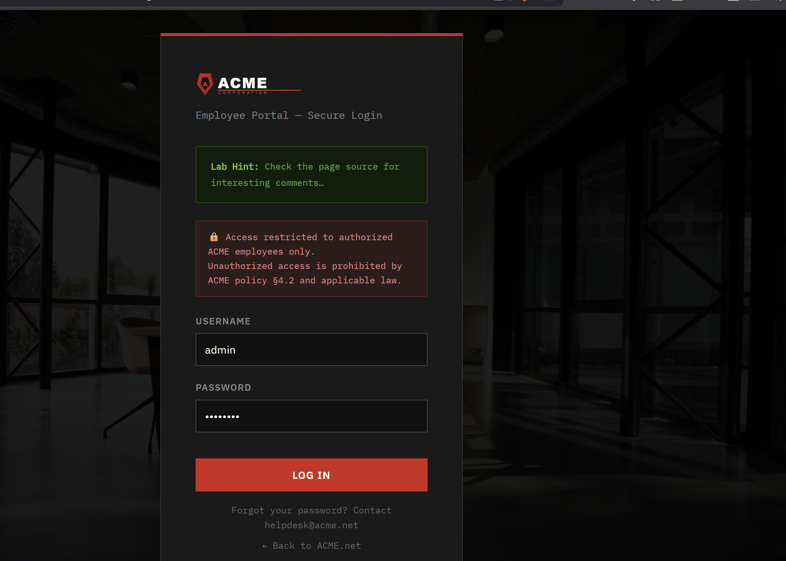
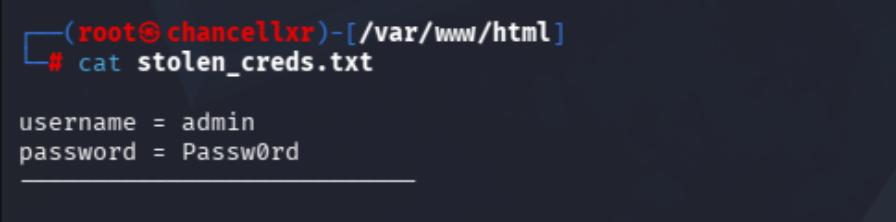

# Credential Harvester Simulation

**Simple Credential Harvester Simulation**

To begin, use Kali Linux and the Apache2 service to host your web server. Apache is pre-installed in Kali, so you won't need to do any installation commands.

1.  Use the following command to ensure the service starts and persists across reboots: sudo systemctl enable \--now apache2

2.  Place website files into the /var/www/html directory. As shown in the image, this directory will contain the site\'s structure.

3.  The file stolen_creds.txt acts as the destination for the harvesting script. To ensure the script has permissions to write data to this file, you must modify its permissions. Run: chmod 777 stolen_creds.txt

Once the web server is live, the next step is to ensure the login page correctly routes user input to your data-handling script.

1.  Open your login.html file using the nano command.

2.  Locate the \<form\> tag and change the action attribute to point to your harvesting script. Change the path to: \<form action=\"post.php\" method=\"POST\"\>

The post.php script serves as the backend logic for the attack. It is responsible for capturing the submitted data, saving it to a local file, and redirecting the victim to avoid suspicion.

1.  The script uses a foreach loop to iterate through all variables sent via the POST method. It then appends these key-value pairs (the username and password) into stolen_creds.txt.

2.  The fopen function uses the **\"a\"** (append) mode, ensuring that new credentials don\'t overwrite previously captured data.

3.  After the data is logged, the header() function redirects the user back to a legitimate-looking page (like the original login.html).

4.  Replace the 0.0.0.0 IP with the actual IP address of your Kali VM. This ensures that once the user submits their info, they are properly routed back to the server hosted on your machine.

This is the host website we will be using the harvester script on. There the victim will type their username and password, and it will be written to the stolen_creds.txt file.

Here are the credentials the victim has typed on the website and there, you will be able to get in the web interface.
