# Phishing Campaign Documentation

**Summary**

This project is about planning and running ethical phishing campaigns and documenting what happens end to end. I used zphisher to create realistic pages, capture evidence, and record how information would be collected in a lab setting. After running this campaign, I will share my thoughts on the project and ways to implement these tests into guidance practice for businesses. This includes training users, tuning technical controls, and using proper simulation platforms so they're better prepared against real phishing.

**1. GitLab Phishing**

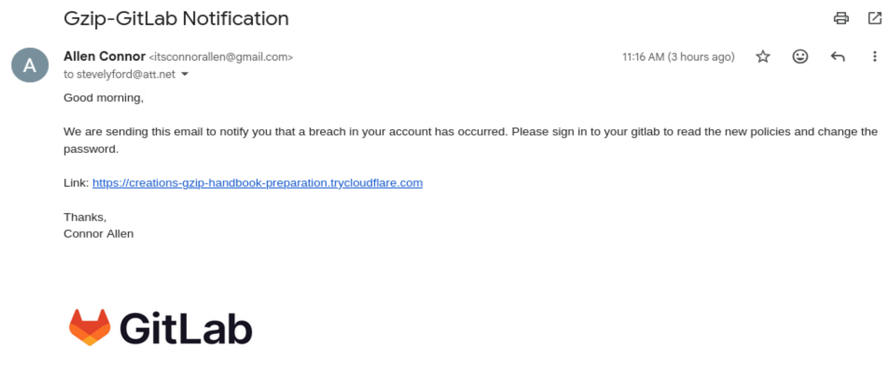

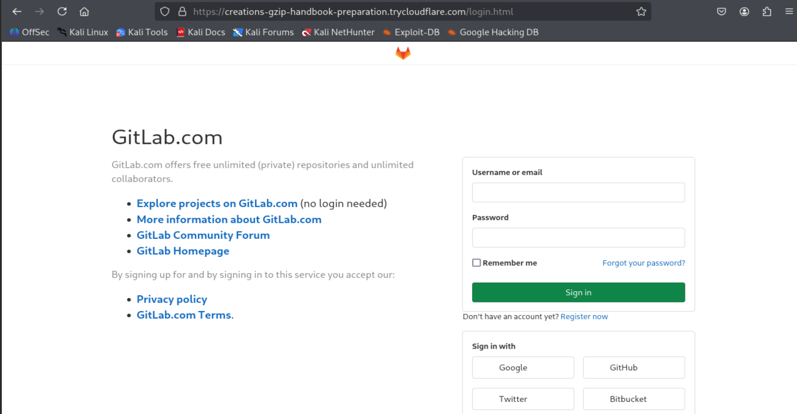

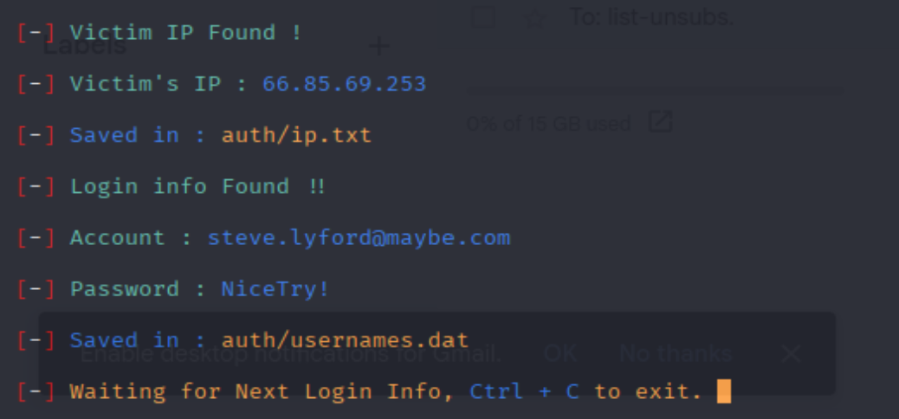

-   I brought up the GitLab template in zphisher, verified the fake login, and captured creds in terminal while most clicks didn't land due to filtering.

**2. Gmail Login Phishing**

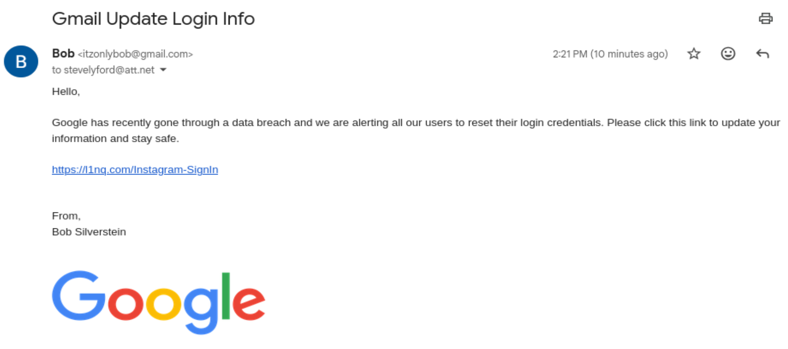

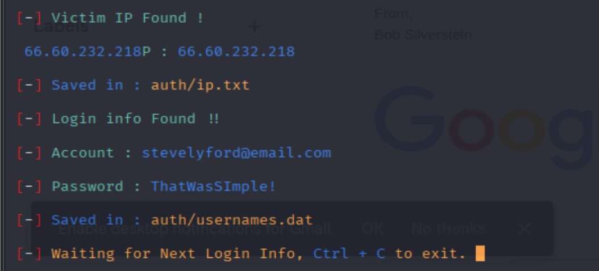

-   I hosted a Gmail page and saw credential posts from my terminal. Access was limited/blocked due to website getting flagged.

**3. Dropbox Phishing**

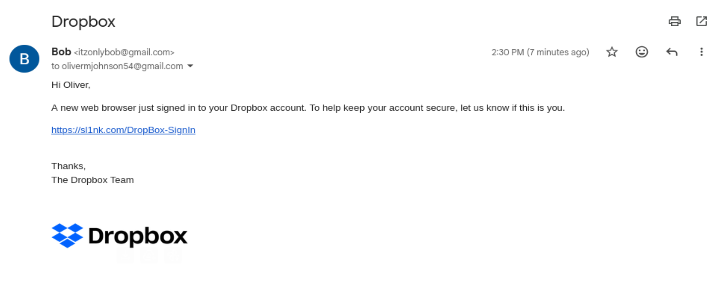

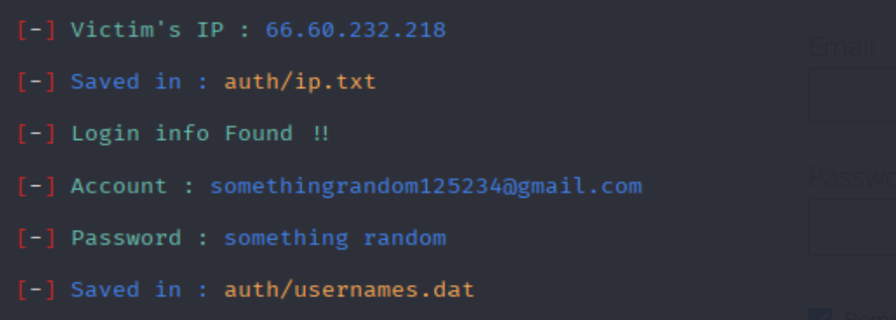

-   I generated the Dropbox template, documented the page and logs, and observed only my submissions as traffic appeared filtered.

**4. GitHub Phishing**

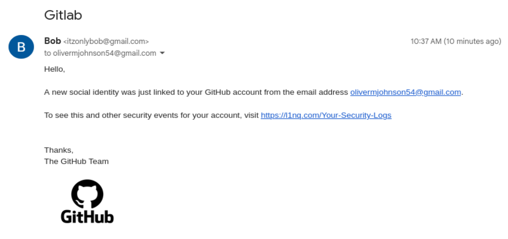

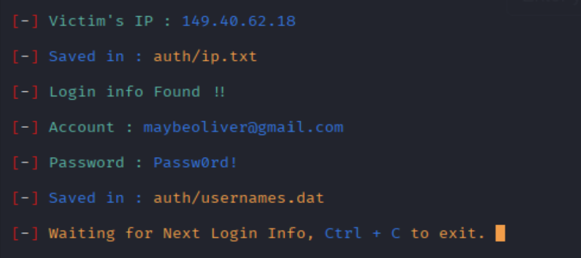

-   I deployed a GitHub page and confirmed capture worked with my own test input. Very few credentials came through, but almost all the clicks were denied before they could be directed to the phishing site. There is consistency with link blocking, which is good.

**5. PlayStation Phishing**

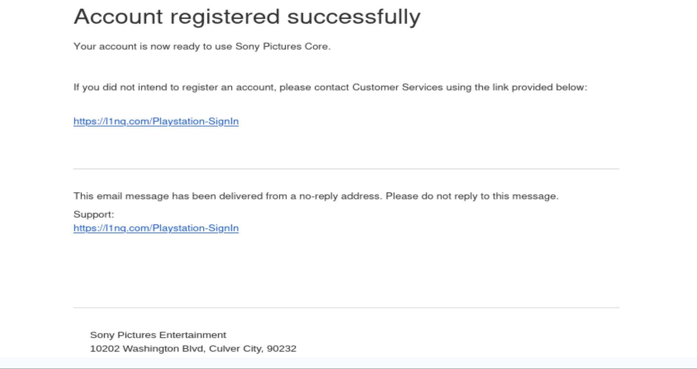

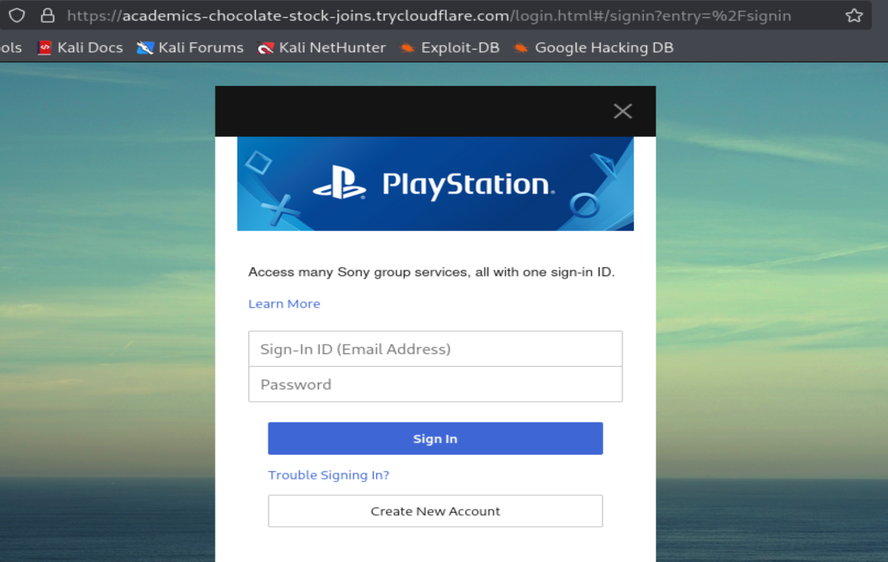

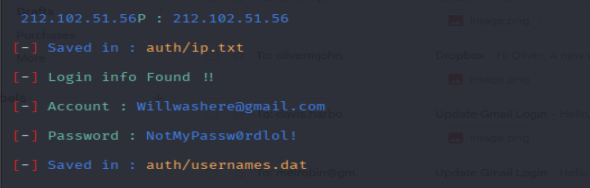

-   I generated the PlayStation site and confirmed credentials that appeared in the terminal, reflecting my practice posts and little to no interaction.

**6. eBay Phishing**

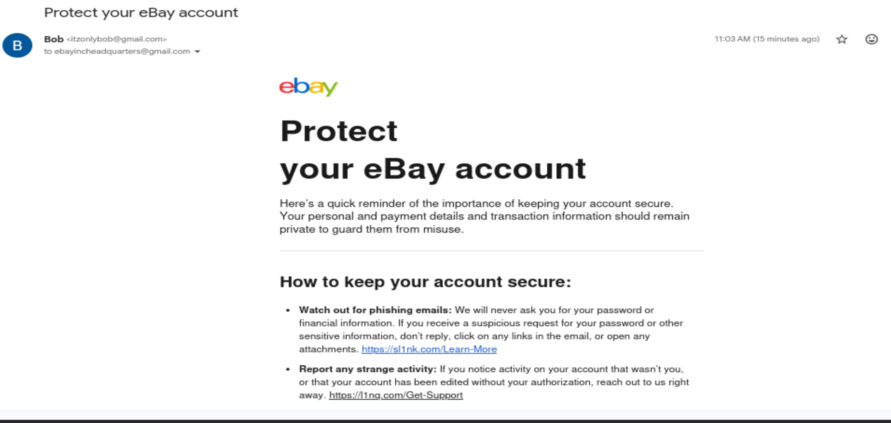

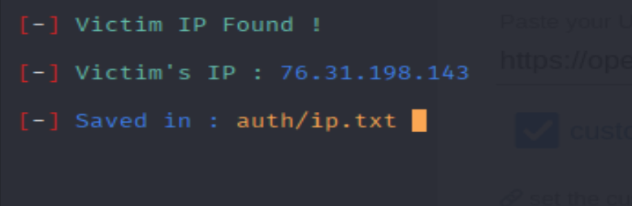

-   I generated the eBay template and recorded UI and logs. The one person that was able to access the link clicked on it but didn't type the login. Others like the previous methods were blocked or the website was flagged down.

**7. Adobe Phishing**

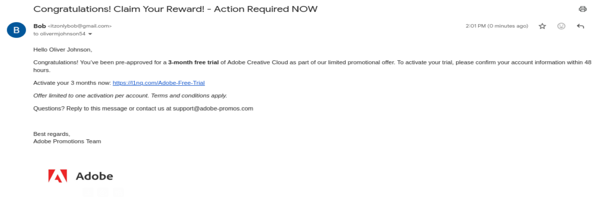

-   Attempted an Adobe phishing template, but the link was blocked when users tried to click it, so there were no results or captured credentials.

**8. Discord Phishing**

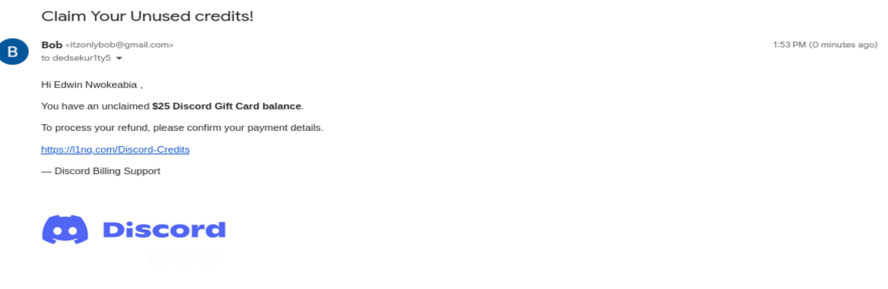

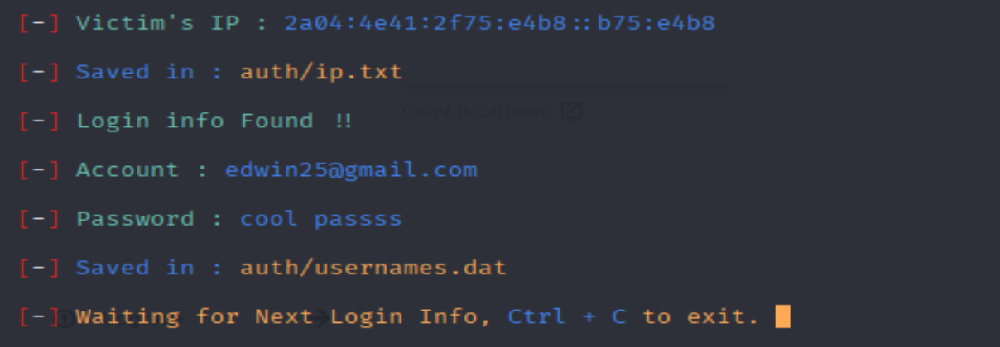

-   I hosted a Discord login for verification. Usernames/passwords or IPs were obtained, but the filtering and flagging limited the process.

**9. Microsoft Phishing**

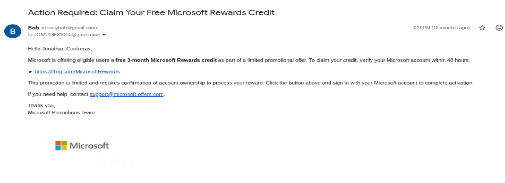

-   Launched a Microsoft-themed page but, links were blocked on click causing no credential or IP captures.

**10. Instagram Phishing**

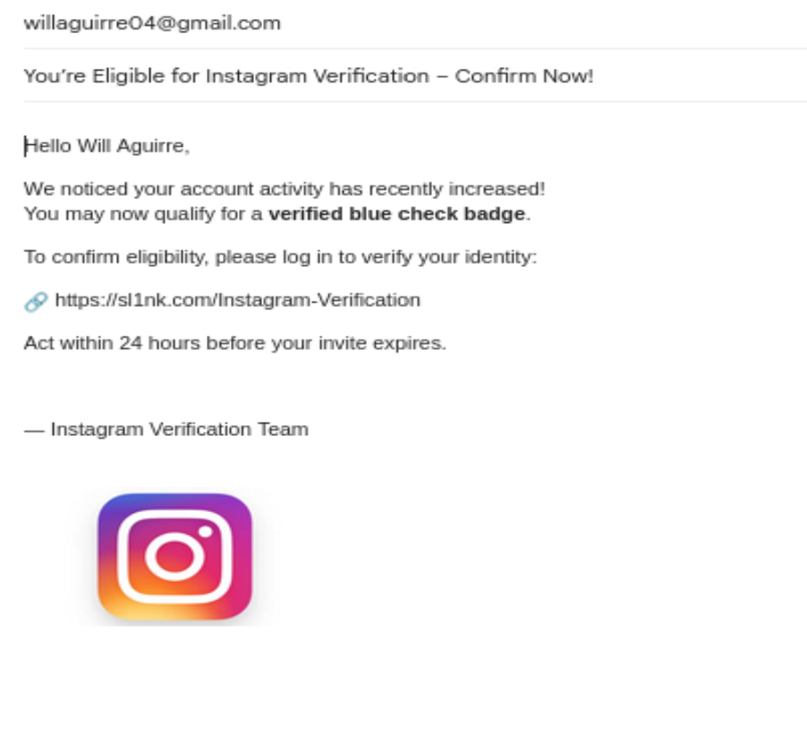

-   I tried an Instagram login template and logged the attempt with screenshots. The link was blocked when accessed and no information was captured.

**Which attack was most successful and why.**

None of my attacks were really succeeded in getting real credentials. At best I saw a single IP and login credentials. However, if I had to choose which was best written, the GitLab, Gmail, Dropbox, and Discord attempts were my best because they were the most convincing, and examples I would probably fall for myself if I weren't paying attention. They fell short mainly because modern email/browser defenses blocked the links before users could interact. Also, the short-lived public hosting got flagged quickly, making the links effectively unusable for exfiltration.

**How to educate users to better prepare businesses.**

Businesses can use this information by improving employee awareness through regular phishing simulations and training programs that teach how to identify and report suspicious emails. Strengthening technical defenses like email filters, MFA, and secure web gateways will help prevent phishing attempts from reaching users. Conducting safe, controlled phishing tests with tools like GoPhish or KnowBe4 allows organizations to measure and improve readiness. Overall, combining user education with security controls builds a stronger defense against phishing attacks.
