# SQL Injection Attack Exercise

**SQL Injection Documentation**

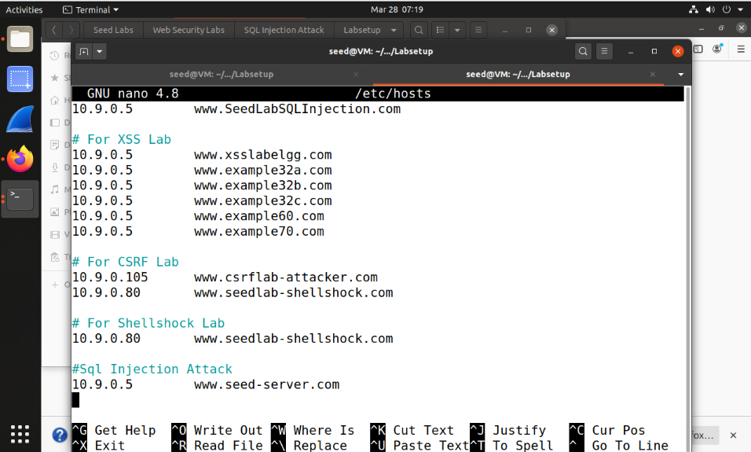

For IP's to align with the labs goal, go into the terminal and use the command "sudo nano /etc/hosts" scroll down to the bottom and create a separate section for the Injection attack server using the IP 10.9.0.5 and the site [www.seed-server.com](http://www.seed-server.com)

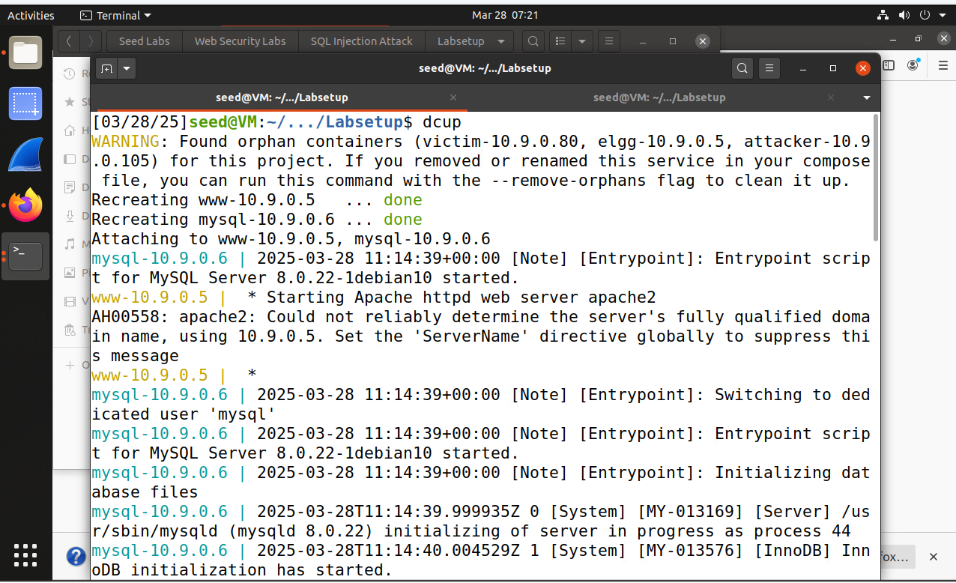

Type in these commands to build the container for the startup:

1.  dcbuild: This command composes the container to run properly

2.  dcup: This command runs the container

The Docker command was executed to initialize and manage containers. During the process, key containers were recreated and attached successfully. The Apache server started, displaying a warning about the fully qualified domain name and advising the configuration of the \'ServerName\' directive.

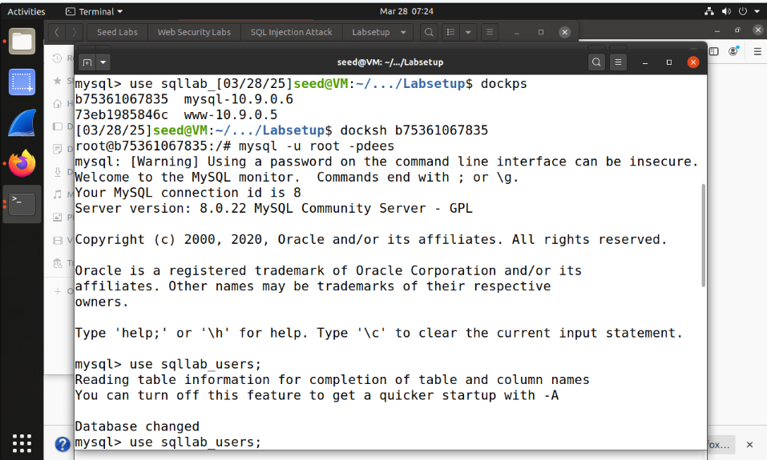

Find the SQL IP using dockps, then use 'docksh b75361067835', the SQL ID number. After doing so, use the command 'MySQL -u root -pdees' to log into the root account.

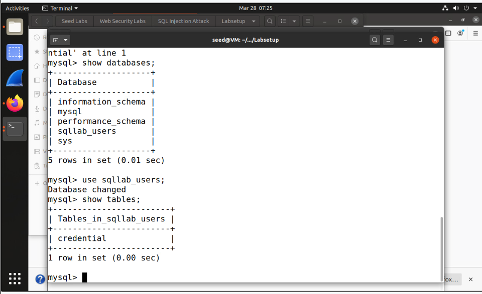

The MySQL command-line interface was used to explore database contents. After listing all available databases using, the database was selected with. Finally, the command revealed a single table, within the selected database.

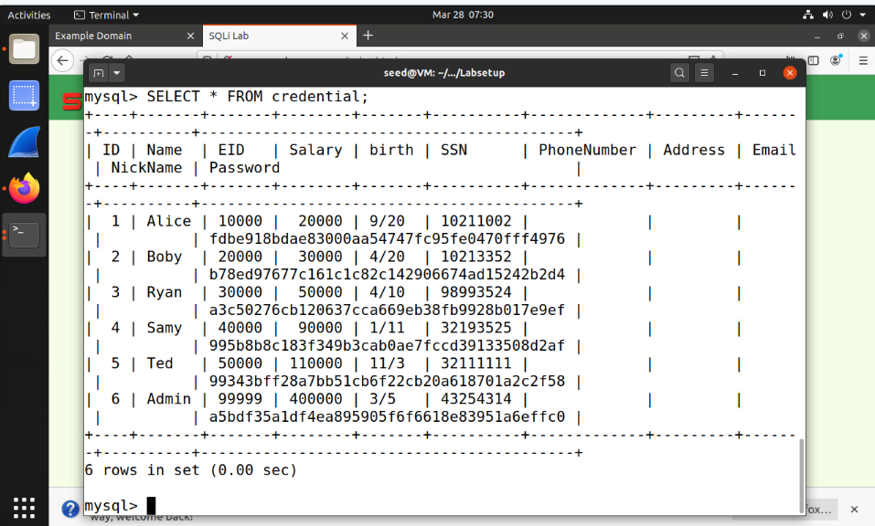

The database was accessed using the SELECT statement. This retrieved six rows of data from the table, presenting information across columns like ID, Name, SSN, Address, and Password in a tabular format for review.

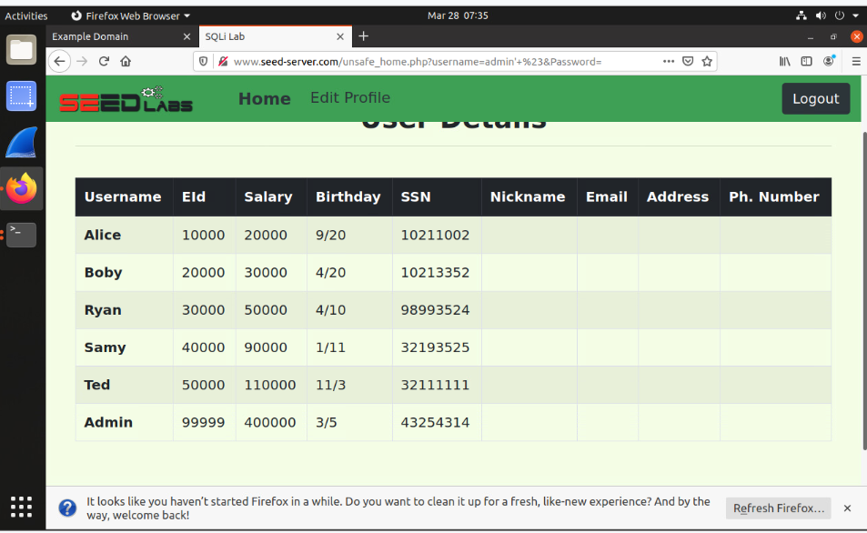

For an SQL injection to get into the admin account, only put "admin' #" in the username credential. The \# turns everything after it into a comment, skipping the password validation. As a result, the system authenticates Alice based solely on the username condition.

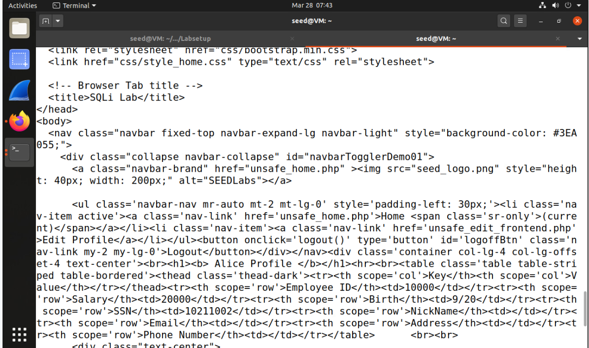

Type the command:

Curl 'www.seedserver.com/unsafe_home.php?username=alice%27%20%23&Password=11'

This command shows a web application displaying employee profile information, specifically for Alice. The application retrieves details such as Employee ID, Salary, and SSN from the database and organizes them in a tabular format for clarity. This interface allows authenticated employees to view their data, reflecting the structure and functionality of the employee management system.

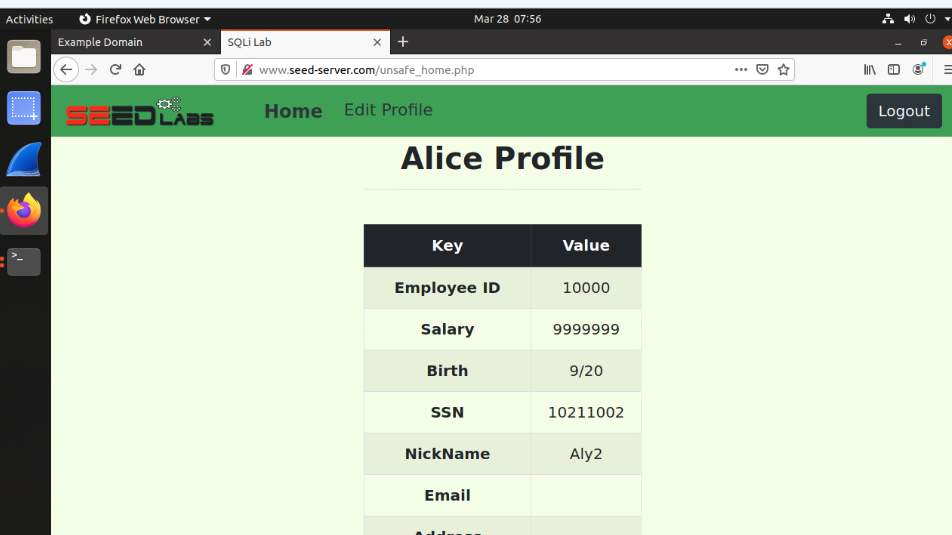

To change Alice's salary to a bigger amount, go into the edit profile in Alice's profile, create a nickname, and save it. After doing so, go into the edit profile again and type in this SQL command: (Aly2' ,Salary='99999999). This command will update Alice's salary to an increased amount compared to what she had before.

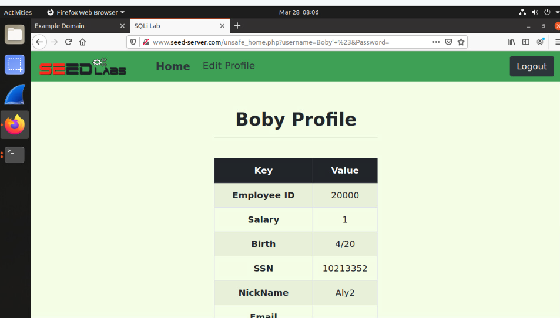

Stay in Alice's profile and in the same edit profile and type in this command in the nickname credential:

Aly2' , Salary = 1 Where name = 'Boby' \#

The command above proves a successful execution of the SQL injection payload from Alice\'s account. The statement has altered Bobby\'s profile data in the database, setting his nickname to \"Aly2\" and his salary to \"1,\" as displayed in the updated profile table. This demonstrates how unvalidated input can exploit SQL injection vulnerabilities, allowing unauthorized modifications to database records.

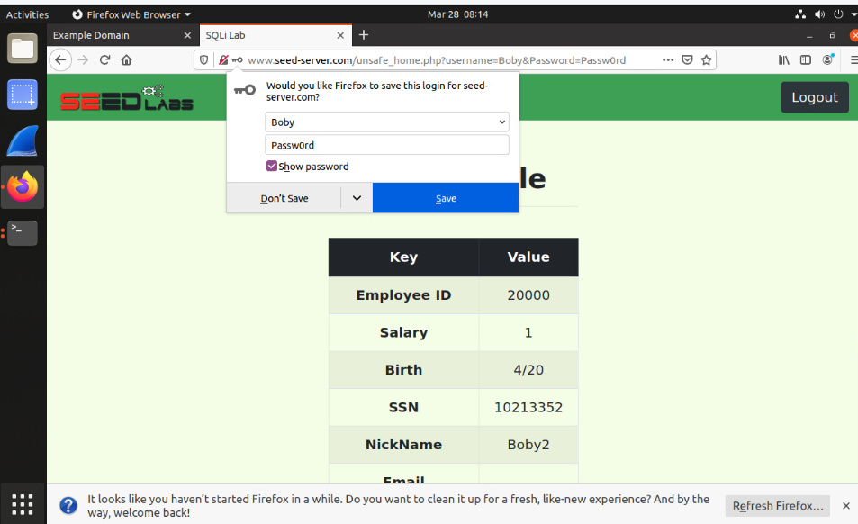

The SQL command updates the nickname field in Alice\'s edit profile section, modifying Boby\'s salary to 1. The command (Boby2', Password = sha1('Passw0rd')) WHERE name = \'Boby\'; is executed, targeting the matching record. This ensures the changes reflect accurately within the sqllab_users database structure.

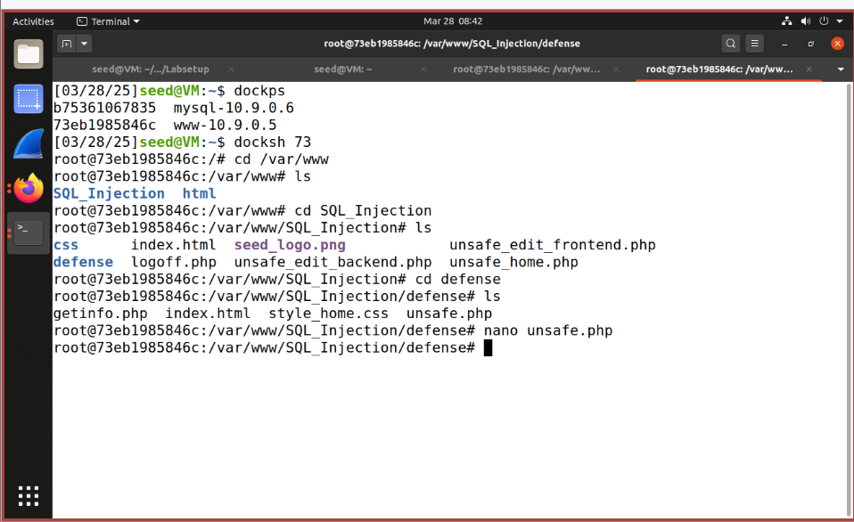

The process begins by navigating to the directory using the command. The command is then utilized to display the directory\'s contents, identifying the files available for processing. Finally, the command opens the file in a text editor, enabling the review and modification of its code. This series of commands ensures precise navigation and controlled editing of specific files.

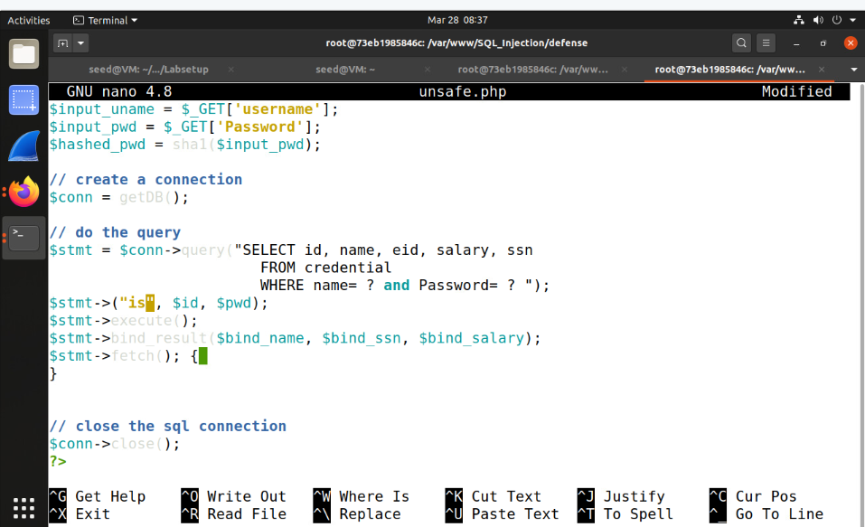

After modifying the file, access and attempt an SQL injection. The injection will be effectively blocked, resulting in a rejection with no information displayed on the screen.
